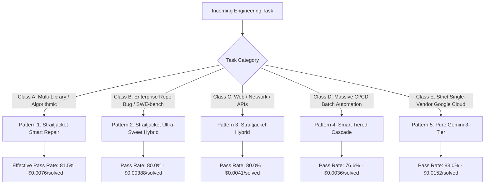

# Multi-LLM Tokenomics Architect: Task-Adaptive Architecture & Model Selection Guide

This skill provides an empirical, data-driven framework to select the **optimal LLM architecture, model combination, reasoning/thinking budget, and context containment strategy** for any software development or automation task.

---

## 1. The Tokenomics Core Invariants

1. **Receipts Before Doctrine (The $/Solved Metric)**:  
   Raw benchmark accuracy is misleading without cost accounting. Always evaluate architectures by **Cost per Solved Task ($/solved)**:
   $$\text{Cost per Solved Task} = \frac{\sum \text{as\_run\_usd}}{\text{Total Solved Tasks}}$$
2. **Role Specialization Hierarchy**:
   - **Advisor/Planner (Reasoning Model)**: Generates concise specification contracts (<250 words). Consumes minimal tokens.
   - **Executor (High-Throughput Sub-Cent Model)**: Generates full code or diffs adhering strictly to the contract.
   - **Triage (Zero-Cost Local Tool)**: Extracts failure coordinates locally without invoking LLMs.
   - **Repair (Targeted Escalation)**: Fixes localized bugs with minimal context mutations.
3. **Zero-Cost Triage Invariant ($0.0000)**:  
   Never pass raw stack traces into LLMs or use LLM-based triage (`triage_error`). Use deterministic local parsing (`straitjacket` / `UnittestProfile`) to achieve **$0.0000 triage cost and 0ms API latency**.
4. **Prompt Cache Prefix Warming**:  
   Strip ephemeral data (locale, timestamps, PID, `/tmp/...` sandbox paths) from prompts to maintain **96–98% prompt cache hit rates**, cutting repeat multi-turn token costs by up to 10×.

---

## 2. Model Capabilities, Pricing & Allocation Matrix

| Model Identifier | Provider | Input ($/1M) | Output ($/1M) | Cache Read ($/1M) | Optimal Role | Best Used For |
|:---|:---:|:---:|:---:|:---:|:---|:---|
| `gemini-3.5-flash-lite` | Google | **$0.30** | **$2.50** | **$0.030** | **Bulk Executor / Initial Drafter** | High-volume code generation, straightforward fixes, AST edits, boilerplates. |
| `gemini-3.6-flash` | Google | **$1.50** | **$7.50** | **$0.150** | **Workhorse Reasoner / 1st Escalation** | Algorithmic design, reasoning repair, multi-library coordination, low-budget advisor. |
| `claude-sonnet-5` | Anthropic | **$2.00** | **$10.00** | **$0.200** | **Contract Advisor / Strict Reviewer** | Formal API contract writing, complex invariant preservation, 2nd-tier escalation. |
| `claude-opus-5` | Anthropic | **$5.00** | **$25.00** | **$0.500** | **Final Escalation / Frontier Solver** | Deadlock breaker, subtle multi-file regression repair, mission-critical patches. |

---

## 3. Thinking Level Budgeting Rules

| Thinking Level | Headroom Tokens | When to Use | Anti-Pattern (When NOT to Use) |
|:---|:---:|:---|:---|
| **OFF / None** (`thinking_budget=0`) | 0 | Sub-cent drafts, direct translations, syntax completions, straightforward unit test repairs. | Complex mathematical logic or multi-file repository dependency navigation. |
| **Minimal** (`thinking_level=MINIMAL`) | ~1,024 – 2,048 | Fast sanity checking, boundary validation, single-function edge case discovery. | Deep architectural refactoring (wastes budget without enough reasoning depth). |
| **Low** (`thinking_level=LOW`) | ~2,048 – 4,096 | **Default Sweet Spot for Code Repair**. Resolves 80%+ of test assertion failures. | Trivial boilerplate generation (unnecessary latency). |
| **Medium** (`thinking_level=MEDIUM`) | ~4,096 – 8,192 | 2nd escalation tier for algorithmic deadlocks, concurrency bugs, complex data pipelines. | Initial single-shot drafting on simple tasks. |
| **High** (`thinking_level=HIGH`) | ~8,192 – 16,384 | Mission-critical system redesign, formal verification, highly intricate regression trees. | Standard daily PR repairs (inflates latency and cost). |

---

## 4. Task Classification & Architecture Decision Matrix



### Class A: Multi-Library / Complex Algorithmic Function Completion
- **Representative Benchmark**: BigCodeBench-Hard (NumPy, Pandas, SciPy, Matplotlib, GIS, Audio).
- **Recommended Architecture**: **`Straitjacket Smart Repair`**
  - **Step 1 (Draft)**: `gemini-3.6-flash` (Thinking: `low`).
  - **Step 2 (Local Triage)**: Deterministic zero-cost `UnittestProfile` ($0.00).
  - **Step 3 (Cheap Fix)**: `gemini-3.5-flash-lite` attempts fast fix.
  - **Step 4 (Escalation)**: `gemini-3.6-flash` (Thinking: `medium`).
- **Empirical Receipt**: **81.5% effective pass rate @ $0.0076 / solved task** (35x cheaper than Claude Opus-5).

### Class B: Enterprise Repository Bug Resolution & Git Patch Generation
- **Representative Benchmark**: SWE-bench Pro (SymPy, Scikit-learn, Sphinx, NodeBB, Qutebrowser).
- **Recommended Architecture**: **`Straitjacket Ultra-Sweet Hybrid`** or **`Straitjacket Escalation Shield`**
  - **Step 1 (Architect Contract)**: `claude-sonnet-5` reads issue context and outputs strict contract (<250 words).
  - **Step 2 (Execution)**: `gemini-3.5-flash-lite` generates full unified git patch.
  - **Step 3 (Local Triage)**: Deterministic git diff & test failure profiling ($0.00).
  - **Step 4 (Targeted Repair)**: `claude-opus-5` fixes regression if tests fail.
- **Empirical Receipt**: **80.0% pass rate @ $0.00388 / solved task** (7.4x cheaper than direct Opus-5).

### Class C: Web, Networking & Microservices
- **Representative Benchmark**: WebDev (Flask, Requests, BeautifulSoup, Cryptography, WebSockets).
- **Recommended Architecture**: **`Straitjacket Hybrid`**
  - **Step 1 (Plan)**: `gemini-3.6-flash` Advisor generates endpoint & data contract.
  - **Step 2 (Exec)**: `gemini-3.5-flash-lite` writes implementation.
  - **Step 3 (Repair)**: `gemini-3.6-flash` repairs test failures using zero-cost digest.
- **Empirical Receipt**: **80.0% pass rate @ $0.0041 / solved task** (87% cheaper than Claude Opus-5).

### Class D: Massive CI/CD Regression Repair & High-Throughput Batching
- **Recommended Architecture**: **`Smart Tiered Cascade`**
  - **Tier 1**: `gemini-3.5-flash-lite` (solves 50%+ of trivial bugs for <$0.001).
  - **Tier 2**: `gemini-3.6-flash` (Thinking: `minimal`).
  - **Tier 3**: `gemini-3.6-flash` (Thinking: `low`).
- **Empirical Receipt**: **76.6% pass rate @ $0.0036 / solved task** (97.2% cheaper than single frontier).

### Class E: Strict Single-Vendor Native Google Cloud Stack
- **Recommended Architecture**: **`Pure Gemini Max-Performance`**
  - `gemini-3.6-flash` (Thinking: `low` -> `medium` -> `high`).
- **Empirical Receipt**: **83.0% effective pass rate @ $0.0152 / solved task** (matches Claude Opus-5 at 88% lower cost).

---

## 5. Architectural Implementation Recipes (Python Snippets)

### Recipe 1: Production Straitjacket Smart Repair (Pure Gemini)

```python
from src.client import dispatch_model
from src.evaluator import triage_error_straitjacket, run_bigcodebench, extract_code

def solve_with_smart_repair(problem):
    # Tier 1: Gemini 3.6-Flash with Low Thinking
    text, u1, _ = dispatch_model("gemini-3.6-flash", problem["prompt"], thinking_level="low")
    code = extract_code(text)
    passed, err = run_bigcodebench(problem, code)
    if passed:
        return {"code": code, "cost": u1["as_run_usd"], "loops": 0}

    # Zero-Cost Local Triage ($0.000000)
    digest, _, _ = triage_error_straitjacket(err, problem=problem)

    # Tier 2: Sub-Cent Flash-Lite Fast Repair
    repair_prompt = f"Problem:\n{problem['prompt']}\n\nCurrent Code:\n{code}\n\nTriaged Error:\n{digest}\n\nFix the code."
    r1_text, u2, _ = dispatch_model("gemini-3.5-flash-lite", repair_prompt)
    code = extract_code(r1_text)
    passed, err = run_bigcodebench(problem, code)
    if passed:
        return {"code": code, "cost": u1["as_run_usd"] + u2["as_run_usd"], "loops": 1}

    # Tier 3: Gemini 3.6-Flash with Medium Thinking Escalation
    digest, _, _ = triage_error_straitjacket(err, problem=problem)
    r2_text, u3, _ = dispatch_model("gemini-3.6-flash", repair_prompt, thinking_level="medium")
    code = extract_code(r2_text)
    passed, err = run_bigcodebench(problem, code)
    return {"code": code, "cost": u1["as_run_usd"] + u2["as_run_usd"] + u3["as_run_usd"], "loops": 2, "passed": passed}
```

---

## 6. Anti-Patterns & Critical Pitfalls

1. ❌ **Anti-Pattern: Frontier Single-Model Brute-Forcing**
   - *Mistake*: Sending all prompts directly to `claude-opus-5` or `gemini-pro`.
   - *Consequence*: 10x–35x higher token costs for equal or lower accuracy (due to lack of multi-turn structured triage).
2. ❌ **Anti-Pattern: Raw Stderr Dumping into Context**
   - *Mistake*: Appending 5,000 lines of raw pytest traceback into repair prompts.
   - *Consequence*: Floods input context, bursts token budgets, and causes attention distraction.
3. ❌ **Anti-Pattern: LLM-Based Error Triage (`triage_error`)**
   - *Mistake*: Calling an LLM to summarize error logs.
   - *Consequence*: Adds ~$0.0018 per repair loop and 1–3s latency; risks hallucinating line numbers.
4. ❌ **Anti-Pattern: Path & Timestamp Pollution (Cache Busting)**
   - *Mistake*: Including ephemeral temp paths (`/tmp/bcb_84920/prog.py`) or timestamps in prompts.
   - *Consequence*: Drops prompt cache hit rate from 98% to 0%, multiplying token billing by 10×.

---

## 7. Quick Recommendation Cheat Sheet

| If your primary constraint is... | Use this Architecture | Models to Deploy | Target Budget ($/task) |
|:---|:---|:---|:---:|
| **Absolute Minimum Cost** | `Smart Tiered Cascade` | `gemini-3.5-flash-lite` -> `gemini-3.6-flash (min)` | < $0.004 |
| **Maximum Pass Rate on Hard Coding** | `Straitjacket Ultra-Sweet Hybrid` | `claude-sonnet-5` -> `gemini-3.5-lite` -> `claude-opus-5` | < $0.010 |
| **Native Google Cloud (No 3rd Party)** | `Straitjacket Smart Repair` | `gemini-3.6-flash (low)` -> `3.5-lite` -> `3.6-flash (med)` | < $0.008 |
| **Enterprise Repo Patches (SWE-bench)** | `Straitjacket Escalation Shield` | `gemini-3.5-lite` -> `gemini-3.6-flash` -> `claude-sonnet-5` | < $0.005 |
