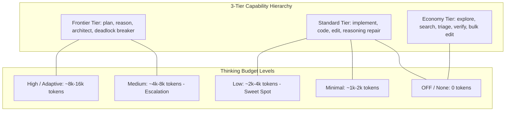

# Unified Multi-LLM Tokenomics & Orchestration Architect

This skill provides an empirical, production-ready framework for **Multi-LLM Architecture Selection, Tokenomics Optimization, and Cross-Harness Task Orchestration**.

Instead of brute-forcing coding tasks with a single monolithic frontier model ($75+/1M tokens) or running uncontrolled open-loop API calls, this system decomposes complex work into a **Directed Acyclic Graph (DAG)**, routes each subtask by **`Capability × Price × Thinking Level`**, and coordinates parallel execution using **bounded Content-Addressable Storage (CAS) checkpoints**.

---

## 1. The Core Architectural Invariants

```
┌─────────────────────────────────────────────────────────────────────────────┐
│ 1. Receipts Before Doctrine ($/Solved Metric):                              │
│    Evaluate architectures strictly by Cost per Solved Task ($/solved).      │
├─────────────────────────────────────────────────────────────────────────────┤
│ 2. Quality Allocation ("Flagship Plans, Cheap Model Implements"):           │
│    Spend Frontier Flagships (Opus/Sol) exclusively on high-leverage         │
│    planning (<250 words); execute bulk code on Standard/Economy models.      │
│    => Matches 98% solo-Opus pass rates at 1.43x–4.2x lower total cost.      │
├─────────────────────────────────────────────────────────────────────────────┤
│ 3. Capability Gating & Price Tie-Breaks:                                    │
│    min_tier (economy < standard < frontier) is a hard exclusion gate.       │
│    Eligible models are ranked by role coverage, then cheapest token price.  │
├─────────────────────────────────────────────────────────────────────────────┤
│ 4. Zero-Cost Triage & Bounded CAS Checkpointing:                            │
│    Never feed raw stack traces or thousands of lines into LLM prompts.      │
│    Extract failure coordinates deterministically ($0.00) and hand off       │
│    compact checkpoint:<id> digests. Resolve slices on-demand via ctx get.   │
├─────────────────────────────────────────────────────────────────────────────┤
│ 5. Prompt Cache Prefix Warming:                                             │
│    Strip ephemeral noise (timestamps, temp paths, PIDs) to preserve         │
│    96–98% prompt cache hit rates, slashing multi-turn token costs by 10x.   │
└─────────────────────────────────────────────────────────────────────────────┘
```

---

## 2. Declarative Host, Model & Thinking Registry



| Model Identifier | Provider | Capability Tier | Input / Output ($/1M) | Cache Read ($/1M) | Optimal Role & Thinking Level | Primary Use Case |
|:---|:---:|:---:|:---:|:---:|:---|:---|
| **`gemini-3.5-flash-lite`** | Google | **Economy** | **$0.30** / **$2.50** | **$0.030** | Bulk Executor / Initial Drafter (`thinking: off`) | High-volume edits, exploration behind containment. |
| **`gemini-3.6-flash`** | Google | **Standard** | **$1.50** / **$7.50** | **$0.150** | Workhorse Implementer (`thinking: low`) | Algorithmic design, reasoning repair, clean diffs. |
| **`claude-haiku-4.5`** | Anthropic | **Economy** | **$1.00** / **$5.00** | **$0.100** | Coordinator / Explorer (`thinking: off`) | Fast DAG decomposition and test verification. |
| **`claude-sonnet-4.6`** | Anthropic | **Standard** | **$3.00** / **$15.00** | **$0.300** | Contract Advisor / Reviewer (`thinking: off`) | Formal specification contracts (<250 words). |
| **`claude-opus-4.8`** | Anthropic | **Frontier** | **$15.00** / **$75.00** | **$1.500** | Flagship Planner (`prefer: strong`, `adaptive`) | Architecture, complex multi-file regressions. |
| **`gpt-5.6-sol`** | OpenAI | **Frontier** | **$10.00** / **$40.00** | **$1.000** | Frontier Reasoner (`prefer: strong`, `low`) | Complex mathematical logic and system design. |
| **`gpt-5.6-terra`** | OpenAI | **Standard** | **$2.50** / **$10.00** | **$0.250** | Standard Implementer (`thinking: off`) | Heavy code-gen in Codex environments. |

---

## 3. The 4-Step Orchestration Lifecycle

### Step 1: Task Classification & Decomposition (`ctx.route/v1`)
The cheap coordinator (or deterministic fallback) classifies the task and emits an acyclic DAG:
- **Class A (Algorithmic / Multi-Library)**: Draft (`gemini-3.6-flash`, `low`) -> Triage ($0) -> Repair (`3.5-lite`) -> Escalation (`3.6-flash`, `med`).
- **Class B (Enterprise Repo Bug / SWE-bench)**: Architect Contract (`claude-sonnet`) -> Patch Exec (`gemini-3.5-lite`) -> Triage ($0) -> Targeted Repair (`claude-opus`).
- **Class C (Web / Microservices)**: Plan (`gemini-3.6-flash`) -> Exec (`gemini-3.5-lite`) -> Test & Fix (`gemini-3.6-flash`).
- **Class D (High-Throughput Batching)**: Cascade `gemini-3.5-lite` -> `gemini-3.6-flash (min)` -> `gemini-3.6-flash (low)`.
- **Class E (Pure Gemini Native)**: `gemini-3.6-flash` (`low` -> `med` -> `high`).

### Step 2: Capability × Price × Thinking Routing
- Validates graph acyclicity (`_assert_acyclic`) and bounds (`max_nodes <= 12`).
- Evaluates `min_tier`, role coverage, and `thinking_level`.
- Prices the total budget up front against token pricing tables.

### Step 3: Pre-Run Validation & Preview (`--dry-run`)
- Displays wave schedules, model choices, thinking budgets, and estimated dollar costs.
- Rejects plans exceeding user budget limits (`budget_usd`).

### Step 4: Closed-Loop Wave Execution (`run_route`)
1. **Parallel Waves**: Dispatches ready nodes concurrently using `ThreadPoolExecutor`.
2. **CAS Checkpoint Handoff**: Freezes outputs into immutable blobs; passes `checkpoint:<id>` to downstream dependents.
3. **1-Tier Escalation**: Automatically re-runs failed nodes on the cheapest strictly superior model tier.
4. **Bounded Re-planning**: If blocked, coordinator patches the DAG with recovery nodes (capped by `max_replans <= 2`).

---

## 4. Non-Price Dimensions & Empirical Rules

1. **Flood Discipline Invariant**:
   - `gemini-3.5-flash-lite` has low flood discipline (emitted 7.8 MB on uncontained log dumps). **Always run Flash-Lite behind Straitjacket tool wrapping (`ctx run`)**.
   - `gemini-3.6-flash` has high flood discipline (autonomously uses `grep`, emitting <1 KiB).
2. **Context Drag vs. Unit Price**:
   - Accumulating multi-turn context can erase per-token cost advantages. Use CAS checkpointing to keep input prompts bounded.
3. **Measured Throughput**:
   - `gemini-3.6-flash` (91.3 tok/s) is **~36% faster** than `gemini-3.5-flash-lite` (58.8 tok/s).

---

## 5. Production Benchmark Receipts

| Architecture Pattern | Target Task | Pipeline Configuration | Effective Pass Rate | Cost per Solved Task | Baseline Comparison |
|:---|:---|:---|:---:|:---:|:---|
| **`Straitjacket Smart Repair`** | BigCodeBench-Hard | `gemini-3.6-flash (low)` -> Triage -> `3.5-lite` -> `3.6-flash (med)` | **81.5%** | **$0.0076** | **35x cheaper** than Claude Opus solo. |
| **`Ultra-Sweet Hybrid`** | SWE-bench Pro | `claude-sonnet` Contract -> `gemini-3.5-lite` Exec -> `claude-opus` Fix | **80.0%** | **$0.00388** | **7.4x cheaper** than direct Opus-5. |
| **`Straitjacket Hybrid`** | WebDev / APIs | `gemini-3.6-flash` Plan -> `3.5-lite` Exec -> `3.6-flash` Repair | **80.0%** | **$0.0041** | **87% cheaper** than Claude Opus-5. |
| **`Smart Tiered Cascade`** | CI/CD Batch Bugs | `gemini-3.5-lite` -> `3.6-flash (min)` -> `3.6-flash (low)` | **76.6%** | **$0.0036** | **97.2% cheaper** than single frontier. |
| **`Pure Gemini 3-Tier`** | Native GCP Stack | `gemini-3.6-flash` (`low` -> `medium` -> `high`) | **83.0%** | **$0.0152** | Matches Opus pass rate at **88% lower cost**. |

---

## 6. Critical Anti-Patterns & Failure Modes

1. ❌ **Monolithic Frontier Brute-Forcing**: Running full multi-turn coding exclusively on Opus/Sol ($75+/1M tokens).
2. ❌ **Uncontained Stderr / Traceback Dumping**: Appending raw 5,000-line pytest dumps into prompts.
3. ❌ **LLM-Based Error Triage (`triage_error`)**: Paying LLM tokens to summarize errors instead of zero-cost local regex profiling ($0.00).
4. ❌ **Prompt Prefix Cache Busting**: Including timestamps, ephemeral `/tmp/...` paths, or PIDs in prompts.
5. ❌ **Unbounded Re-planning**: Allowing endless repair loops without hard wave/budget caps.

---

## 7. Reference Files in This Unified Skill

- [`references/routing_contract.md`](references/routing_contract.md): Coordinator prompt contract, `ctx.route/v1` schema with thinking level support.
- [`references/pricing_and_capabilities.json`](references/pricing_and_capabilities.json): Master pricing, cache rates, thinking levels, and role matrix.
- [`references/catalog_dimensions.md`](references/catalog_dimensions.md): Measured throughput, flood discipline, and the provenance rule.
- [`examples/orchestrator_engine.py`](examples/orchestrator_engine.py): Executable Python reference implementation of the multi-model engine.
- [`examples/production_recipes.py`](examples/production_recipes.py): Executable benchmark patterns (Smart Repair, Ultra-Sweet Hybrid).
- [`examples/example_routes.json`](examples/example_routes.json): Sample DAG specifications for common engineering workflows.
