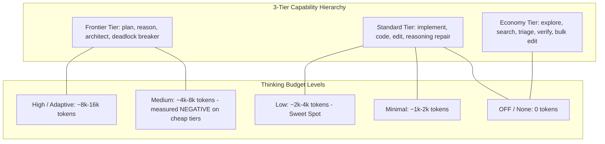

# Unified Multi-LLM Tokenomics & Orchestration Architect

This skill provides an empirical, production-ready framework for **Multi-LLM Architecture Selection, Tokenomics Optimization, and Cross-Harness Task Orchestration**.

Instead of brute-forcing coding tasks with a single monolithic frontier model or running uncontrolled open-loop API calls, this system decomposes complex work into a **Directed Acyclic Graph (DAG)**, routes each subtask by **`Capability × Price × Thinking Level`**, and coordinates parallel execution using **bounded Content-Addressable Storage (CAS) checkpoints**.

**Provenance.** §5 is measured live over 148 + 91 tasks (BigCodeBench-Hard, ClassEval) and reconciles with its own raw records. §5.4 adds 20 rows of SWE-bench Pro and is **directional only** — nothing in it is significant, and it is labelled so wherever it appears. Everything not marked measured is a design position, not a receipt.

---

## 1. The Core Architectural Invariants

```
┌─────────────────────────────────────────────────────────────────────────────┐
│ 1. Receipts Before Doctrine ($/Solved Metric):                              │
│    Evaluate architectures strictly by Cost per Solved Task ($/solved),      │
│    always beside the same-budget frontier baseline. Never quote a           │
│    pass rate without the spend that bought it.                              │
├─────────────────────────────────────────────────────────────────────────────┤
│ 2. Spend the Flagship on EVIDENCE, not in advance:                          │
│    A planning turn commits frontier spend against a prior; an escalation    │
│    turn commits it against an oracle that has already executed. Where the   │
│    oracle is cheap, escalation wins — measured on both datasets here.       │
│    => 96% of frontier pass rate for 74% of frontier spend (BCB-Hard N=148). │
├─────────────────────────────────────────────────────────────────────────────┤
│ 3. Escalate the MODEL, not the THINKING BUDGET:                             │
│    Turning a cheap model's reasoning up is the most expensive mistake       │
│    available: 6,513 vs 1,221 output tokens/task, 33% more money, 14 fewer   │
│    solved tasks than the frontier model it was meant to avoid.              │
├─────────────────────────────────────────────────────────────────────────────┤
│ 4. Escalation is a one-way ratchet:                                         │
│    A repair turn that de-escalates rescues 16% of failures against 41%      │
│    for one that escalates (z = +3.55, p = 0.0004). Never route downward,    │
│    and never discard the failing candidate when you escalate.               │
├─────────────────────────────────────────────────────────────────────────────┤
│ 5. Zero-Cost Triage & Bounded CAS Checkpointing:                            │
│    Never feed raw stack traces or thousands of lines into LLM prompts.      │
│    Extract failure coordinates deterministically ($0.00), hand off compact  │
│    checkpoint:<id> digests, resolve slices on demand via ctx get.           │
├─────────────────────────────────────────────────────────────────────────────┤
│ 6. Prompt Cache Prefix Warming:                                             │
│    Strip ephemeral noise (timestamps, temp paths, PIDs) to preserve         │
│    96–98% prompt cache hit rates across multi-turn repair.                  │
└─────────────────────────────────────────────────────────────────────────────┘
```

---

## 2. Declarative Host, Model & Thinking Registry



### 2.1 The measured registry (Vertex AI rates, [`src/config.py`](../../../src/config.py))

These four models produced every number in §5. Prices are USD per 1M tokens.

| Model Identifier | Provider | Capability Tier | Input / Output | Cache Read | Optimal Role & Thinking Level | Primary Use Case |
|:---|:---:|:---:|:---:|:---:|:---|:---|
| **`gemini-3.5-flash-lite`** | Google | **Economy** | **$0.30** / **$2.50** | $0.030 | First draft only, where a wasted attempt is ~free (`thinking: off`) | Bulk edits, exploration behind containment. |
| **`gemini-3.7-flash`** | Google | **Standard** | **$1.50** / **$7.50** | $0.150 | Workhorse implementer (`thinking: low` — **not** `medium`) | Algorithmic repair, clean diffs. |
| **`claude-sonnet-5`** | Anthropic | **Standard** | **$2.00** / **$10.00** | $0.200 | Cheapest arm that still works (`thinking: off`) | Contracts (<250 words); best `$/solved` on BCB-Hard N=148 at 66.9% — **and the worst on FeatureBench N=48 at $4.05/solved. `$/solved` is a dataset property, not a model property.** |
| **`claude-opus-5`** | Anthropic | **Frontier** | **$5.00** / **$25.00** | $0.500 | Evidence-gated repair rung; the accuracy ceiling | Complex multi-library regressions. |

**Read the ratio, not the tier label.** At these rates the frontier model's output token is only **3.3×** the standard Gemini's — so a cheap rung emitting 5.3× the output tokens is *already more expensive than the frontier model*. That single ratio explains invariant 3, and it is why a pricing table quoted from memory (frontier at $15/$75) inverts the correct decision.

### 2.2 The wider catalog (unmeasured here)

[`references/pricing_and_capabilities.json`](references/pricing_and_capabilities.json) carries list prices and role matrices for models this repository never ran (Claude Haiku/Sonnet-4.6/Opus-4.8, GPT-5.6 Sol/Terra/Luna, Gemini 3.1 Pro). Use it for routing *shape* — `min_tier` gating, role coverage, price tie-breaks — and never present a row from it as a benchmark result. Its Anthropic/OpenAI rows are vendor list prices, not the Vertex rates in §2.1, and the two must not be mixed inside one cost model.

---

## 3. The 4-Step Orchestration Lifecycle

### Step 1: Task Classification & Decomposition (`ctx.route/v1`)
The cheap coordinator (or deterministic fallback) classifies the task and emits an acyclic DAG:
- **Class A (Algorithmic / Multi-Library)** — *measured*: Draft (`gemini-3.5-flash-lite`) → Triage ($0) → Repair (`gemini-3.7-flash`, `low`) → **escalate to `claude-opus-5` when the typed digest reads `broad`/`stalled`**, not after a fixed number of failures. BCB-Hard N=148: **81.1% at $0.0353/solved**.
- **Class B (Enterprise Repo Bug / multi-file patch)** — *directional only*: use the **same evidence gate as Class A**, and specifically *not* the architect-contract-first shape this entry used to recommend. On SWE-bench Pro at N=20 the evidence gate ranked first (40%) and the plan-first challenger last (25%), matching Class A's ordering — but every pairwise gap is p ≥ 0.50, and 42–56% of attempts died before a test ran. **Quote the direction, never the number** (§5.4). Two things do transfer without qualification: hold the oracle-call budget constant, and expect the gate to be the *most* expensive multi-model arm here rather than the cheapest (§6).
- **Class C (Web / Microservices)**: Plan (`gemini-3.7-flash`) → Exec (`gemini-3.5-flash-lite`) → Test & Fix (`gemini-3.7-flash`).
- **Class D (High-Throughput Batching)**: Cascade `gemini-3.5-flash-lite` → `gemini-3.7-flash (min)` → `gemini-3.7-flash (low)`.
- **Class E (Pure Gemini Native, no frontier budget)** — *measured*: `3.5-lite` → `3.7-flash (low)` → `3.7-flash (med)` — 73.0% at $0.0362/solved. **Do not use the `low → med → high` thinking ladder**: 75.7% at $0.0674/solved, the worst value of any arm tested.

### Step 2: Capability × Price × Thinking Routing
- Validates graph acyclicity (`_assert_acyclic`) and bounds (`max_nodes <= 12`).
- Evaluates `min_tier`, role coverage, and `thinking_level`.
- Prices the total budget up front against §2.1.

### Step 3: Pre-Run Validation & Preview (`--dry-run`)
- Displays wave schedules, model choices, thinking budgets, and estimated dollar costs.
- Rejects plans exceeding user budget limits (`budget_usd`).
- **Treat the estimate as an order of magnitude.** The N=148 routing study overshot its own pre-run estimate by ~1.3×; a dataset with a wide prompt-length spread will do worse.

### Step 4: Closed-Loop Wave Execution (`run_route`)
1. **Parallel Waves**: Dispatches ready nodes concurrently using `ThreadPoolExecutor`.
2. **CAS Checkpoint Handoff**: Freezes outputs into immutable blobs; passes `checkpoint:<id>` to downstream dependents.
3. **Evidence-gated escalation** (preferred) or 1-tier escalation to the cheapest strictly superior tier. Never de-escalate; never hand the failing candidate's context back.
4. **Bounded Re-planning**: If blocked, coordinator patches the DAG with recovery nodes (capped by `max_replans <= 2`).

---

## 4. The Escalation Gate (what to actually route on)

The gate reads the harness's **typed** evidence graph, which costs $0 because the capture already happened ([`src/routing.py`](../../../src/routing.py)):

| Level | Rule | Action |
|---|---|---|
| `shallow` | all failure classes ∈ {Syntax, Indentation, Tab, Import, ModuleNotFound, Name}Error | stay cheap — the candidate never ran; any model fixes it |
| `local` | 1–2 distinct failing identities | stay cheap — one bug |
| `broad` | ≥ 3 distinct failing identities | **escalate now** |
| `stalled` | the identical failing identity set survived a repair turn | **escalate now** — no convergence |

Three operational rules:

1. **Make one cheap attempt regardless** (`min_attempt=1`). It is nearly free and often enough. What measured *worse* is escalating on the first failure by the counter alone, ignoring what failed: 75.7% at $0.0498, the worst `$/solved` of any arm that used the frontier tier. One cheap attempt, then read the evidence — not the attempt number.
2. **The fact tier requires the in-process harness backend.** Under a CLI backend everything classifies `shallow`, the gate never fires early, and the arm silently becomes an attempt-count ladder. Detect, warn, and mark the record `degraded` — 11 of 148 tasks hit the no-fact-tier path even on the good backend.
3. **Never present a degraded row as an evidence-gated result.** It did not test what its name says.

---

## 5. Production Benchmark Receipts

Read from the sweeps that are instrumented end to end and reconcile with their own raw records: **BigCodeBench-Hard N=148** (`reports/19_bcb-hard_straitjacket_n148.md`, the complete dataset), **BigCodeBench-Hard N=100** (`reports/12_bcb-hard_straitjacket_n100.md`) and **ClassEval N=91** (`reports/17_classeval_opus5_n91.md`).

§5.4 adds **SWE-bench Pro N=20** (`reports/31_swebench-pro_straitjacket_n20.md`), which is directional only and kept in its own section for that reason.

**Rows from different sweeps are not comparable** — attempt budget differs (three rungs at N=148, two at N=100), which alone moves `claude-opus-5` from 76% to 84.5%. Compare within a sweep only.

| Architecture Pattern | Sweep | Pipeline Configuration | Pass Rate | Cost per Solved Task | Read against the frontier |
|:---|:---|:---|:---:|:---:|:---|
| **`Evidence-gated escalation`** ⭐ | BCB-Hard N=148 | Lite → `3.7 low` → `3.7 med` → `opus-5` **when the digest reads `broad`/`stalled`** | **81.1%** | **$0.0353** | 96% of Opus's pass rate for 74% of its spend. **The recommended default.** |
| **`Ladder then frontier`** | BCB-Hard N=148 | Lite → `3.7 low` → `3.7 med` → `opus-5` after every rung fails | **84.5%** | $0.0452 | ties Opus-solo exactly, at 99% of its $/solved — the ladder bought nothing. |
| **`Single: claude-opus-5`** | BCB-Hard N=148 | `claude-opus-5` ×3 | **84.5%** | $0.0456 | the accuracy ceiling on the full dataset. |
| **`Frontier re-solves from scratch`** ❌ | BCB-Hard N=148 | ladder → `opus-5` **discards** the failing candidate | 82.4% | $0.0417 | frontier yield 35% vs 47% — **keep the candidate and the digest.** |
| **`Gemini ladder, no frontier`** | BCB-Hard N=148 | Lite → `3.7 low` → `3.7 med` | 73.0% | $0.0362 | what you get with no frontier budget at all. |
| **`3.7-flash (medium) ×3`** ❌ | BCB-Hard N=148 | thinking turned up instead of the model | 75.0% | $0.0684 | **costs 33% more than opus-5 and solves 14 fewer tasks.** |
| **`Single: claude-sonnet-5`** | BCB-Hard N=148 | `claude-sonnet-5` ×3 | 66.9% | **$0.0289** | cheapest per solved task on the board. |
| **`Whole-class Cascade`** | ClassEval N=91 | `3.5-lite` → `3.7-flash (low)` → `3.7-flash (med)` | **80%** | $0.0371 | best non-frontier arm on ClassEval. |
| **`Plan → execute`** | ClassEval N=91 | per-method contracts, cheap executor writes the class | 77% | $0.0266 | 88% of Opus's pass rate at 57% of its $/solved. Planning is not dead on a genuinely decomposable task — but it still trails the cascade by 3 points, and adding difficulty routing on top makes it worse (71%, $0.0410). |
| **`Per-method, one model`** | ClassEval N=91 | every method to `gemini-3.5-flash-lite` | 73% | **$0.0210** | the control — beats difficulty routing on both axes. |
| **`Per-method, routed by difficulty`** ❌ | ClassEval N=91 | each method to a tier by its labelled dependency structure | 71% | $0.0317 | **the hypothesis, and it lost to its own control.** |
| **`Single: claude-opus-5`** | ClassEval N=91 | `claude-opus-5`, whole class | **88%** | $0.0464 | the accuracy ceiling on this slice. |

### 5.1 The ceiling, and why this is a cost play

Across all eleven N=148 arms the union of everything solved is **135/148 (91%)** — thirteen tasks are out of reach for every model and every ladder tested. The best single arm reaches 84.5%, so **the accuracy headroom left to any router is about 6 points**, and the arm that wins on cost gives up 5 of them. Anything reporting above 91% on this dataset is a measurement error, not a breakthrough. *Decide what you are optimising before you pick an arm: on a dataset with this little headroom, routing buys dollars, not accuracy.*

### 5.2 Five negative results are load-bearing

1. **A high-thinking cheap rung is not cheap.** `gemini-3.7-flash` at `medium` emits 6,513 output tokens/task against `claude-opus-5`'s 1,221 — more money, worse score. Escalate the *model*, not the *thinking budget*.
2. **An attempt-count ladder in front of a frontier model earns nothing** at a three-rung budget: identical pass rate, identical cost. If the frontier model is going to be called, call it on evidence and sooner. (At a *two*-attempt budget on the N=100 slice it did look like a saving — the finding is budget-dependent, which is exactly why sweeps must not be merged.)
3. **Routing sub-tasks by labelled difficulty** lost to a flat per-method control (71% at $0.0317 vs 73% at $0.0210) — the cheap rung delivered **206 of 207** methods routed to it, so it was never the bottleneck the hypothesis assumed. The residue is a hard tail that needs a *better model*, not a better assignment. On the hardest tier the routed arm scored 85/102 against the cascade's 90/102: routing a method up does not help when what makes it hard is its dependence on the other methods in the same class, which a per-method prompt cannot show.
4. **A repair turn that de-escalates** rescues 16% of failures against 41% for one that escalates (z = +3.55, p = 0.0004).
5. **Decomposition has its own failure mode.** Every per-method arm carried exactly one class where all methods passed their own tests and the assembled class still failed; no whole-class arm did. One in 91 decided nothing, but it is a cost only splitting can incur — watch it on wider classes.

### 5.3 And one positive mechanism, stated precisely

The evidence gate wins by escalating **more often** (45% of tasks vs 29%) but **earlier**, skipping the expensive `medium`-thinking rung that was going to fail anyway. Its gate is also the most selective: 58% of what it escalated got solved, against 47% for the ladder and 35% for the fresh-solve arm. **Do not read "call the frontier model less" as the lesson; the lesson is "stop paying for rungs that will not work".**

### 5.4 SWE-bench Pro N=20 — the expensive-oracle rows, and why they are directional

The first rows in this repository where the oracle costs real money: an attempt applies a patch inside the repository's own container and runs that repository's suite, graded by upstream's own script and parser. Four arms, python only, three container test runs each (`reports/31_swebench-pro_straitjacket_n20.md`).

| Arm | Resolved | Total cost | $ / solved | Attempts reaching the suite |
|:---|:---:|:---:|:---:|:---:|
| **`Evidence gate`** (the Class A shape) | **8/20 (40%)** | $7.82 | $0.977 | 42% |
| `Single: claude-sonnet-5` ×3 | 6/20 (30%) | **$3.40** | **$0.566** | 56% |
| `Cascade` (attempt-count gate) | 6/20 (30%) | $7.12 | $1.187 | 44% |
| **`Plan → execute`** (the H2 challenger) ❌ | 5/20 (25%) | $5.52 | $1.104 | 21% |

**The ordering matches BCB-Hard and the H2 challenger is last.** That is all it says. Every pairwise Fisher exact test is p ≥ 0.50, the 95% CIs span 22–61% and 11–47%, and 42–56% of attempts never reached a test at all — they died at `git apply`. **Never put these rows in a table with §5's, and never quote a percentage from them without the p-value beside it.**

Two facts here are solid because they are about the measurement, not the ranking:

1. **The gate's cost position inverted, exactly as §6 predicted before the run.** With no expensive middle rung to skip, the evidence gate became the *most* expensive multi-model arm ($0.977/solved against sonnet solo's $0.566) instead of the cheapest. The mechanism from §5.3 — the saving comes from skipping a doomed expensive rung — has no expensive rung to skip here, so the saving does not exist. **A routing policy's cost position is a property of the ladder it sits in.**
2. **On a multi-file-patch dataset the dominant failure is the patch format, not the routing.** An arm's pass rate is partly a measure of whether it emits a diff `git apply` accepts. Fix that before reading any routing comparison — and return the apply log to the repair turn as evidence, or the model spends the turn debugging a test run that never happened.

---

## 6. Scope limit: the cheap-oracle findings, and what happens when the oracle costs money

Everything in §5.1–§5.3 was measured where tests run in a sandbox for **$0 in milliseconds** — the regime that most favours *fail → escalate*, because the routing signal is free, instant and exact. The hypothesis that scopes it:

> **H2.** As the oracle gets more expensive or more partial, the cascade's advantage shrinks, because *fail → escalate* stops being a free routing signal.

**H2 has been attacked twice and remains open.**

| Attempt | What happened | Verdict |
|:---|:---|:---|
| **FeatureBench N=48** | Ran fully live. The sweep is confounded: the oracle budget differed across arms, four arms were replayed from a cache written under the older budget, three arms did not run the architecture their row names, and 94% of failures were rejected diffs rather than failed tests. | **Unusable — its rows belong in no comparison table.** |
| **SWE-bench Pro N=20** | Ran on upstream's own grading with one asserted oracle budget. The arms ranked as the cheap-oracle result predicts and the plan-first challenger came last. | **Directional only — every gap p ≥ 0.50** (§5.4). |

So the scope limit still stands: **evidence-gated escalation is the default *where retry is cheap*.** Where retry is expensive there is a direction and no result. Closing it means one language, N ≥ 100, with the patch-application failure rate driven down first.

### 6.1 Design rules for any expensive-oracle ladder

Derived from the measured results and confirmed by both failures above:

- **Hold oracle calls constant across arms, and *assert* it.** It is the scarce resource; if arms differ in container runs you are measuring Docker, not routing. A planning arm buys one extra *LLM* call, which shows up in dollars where it belongs.
- **Check that the escalation branch is reachable at all.** A gate evaluated once per repair turn against a K-entry ladder cannot fire at a budget of K oracle calls — the frontier rung is unreachable code and the arm silently becomes a single-model loop wearing a cascade's name. **This defect voided three separate sweeps in this repository before it was caught** (FeatureBench report 22, SWE-bench Pro reports 21 and 23), each time producing a full, plausible-looking, entirely live results table. Assert reachability over the arm registry, not in a comment — it is the cheapest assertion here and the one whose absence costs the most.
- **Drop the sub-cent first rung.** `gemini-3.5-flash-lite` earned its place when a wasted attempt cost a fraction of a cent. When a wasted attempt costs a container run, spending it on a rung that cannot plausibly succeed is the exact mistake H2 is about.
- **A spare attempt is spent on the rung already held**, never handed back — an arm that quietly returns an oracle call reads as cheaper for a reason unrelated to its routing policy.
- **Expect the evidence gate to invert its cost position.** With no expensive middle rung to skip, an early gate holds the frontier rung for the remaining attempts and becomes the *most* expensive multi-model arm. **This was written as a prediction and then observed** (§5.4). Whether it earns that back in resolved tasks is the measurement — not a bug.
- **Type the failure before writing the repair prompt.** A turn that opens with "your patch was applied and the tests failed" is a false premise when the patch never applied, and the model spends it inventing a code-level explanation for a diff-format problem. Route the repair instruction on the guard reason: rejected patch, container failure, and genuine test failure are three different turns.
- **Report how many attempts reached the oracle at all.** A pass rate over attempts that mostly died at a guard is not a pass rate. Print the guard-failure census beside it, or the number means something other than what it says.

---

## 7. Non-Price Dimensions

Price per token is not the only axis, and two of the others are measured:

1. **Flood discipline** — `gemini-3.5-flash-lite` has low flood discipline (emitted 7.8 MB on uncontained log dumps); `gemini-3.7-flash` has high discipline (autonomously reaches for `grep`, emitting <1 KiB). **Always run the economy tier behind containment** (`ctx run`), or its cheap tokens arrive as an expensive transcript.
2. **Measured throughput** — `gemini-3.7-flash` 91.3 tok/s vs `gemini-3.5-flash-lite` 58.8 tok/s: the "cheap" model is also **~36% slower** per token, and it emits more of them on a repair loop.
3. **Context drag vs unit price** — accumulating multi-turn context erases per-token advantages. Keep prompts bounded with CAS checkpoints and digests; residency, not the single turn, is where a cheap model becomes expensive.
4. **Input-heavy datasets invert the arithmetic.** Everything in §5 is output-token dominated (BCB-Hard prompts average ~305 tokens). Where statements run 6k–77k characters (§6), input pricing and cache-read rates decide the ranking instead — re-derive, do not transplant.

Provenance rule: a dimension belongs in [`references/catalog_dimensions.md`](references/catalog_dimensions.md) only if it was measured, with the run that measured it named.

---

## 8. Measurement Discipline (how these numbers stay trustworthy)

1. **A hypothesis arm needs its own control.** `ce_route_flat` (same per-method loop, one model, no routing) is what turned "difficulty routing beats a whole-class single model" into "writing method-by-method is doing the work, and sorting by difficulty subtracts from it". The analyzer refuses to bless a result whose control is missing from the sweep.
2. **Never score by proxy.** A dataset was deleted from this repository — with its three reports — because candidate patches were substring-matched against the canonical patch and printed in a column labelled "pass rate". A similarity proxy in a pass-rate column is worse than no dataset. It was later re-adopted only once *upstream's own* image, restore command, run script and parser decided every verdict; nothing from the deleted version was carried forward. **Deleting and re-earning is the cheaper path — annotating a bad metric is not.**
3. **Preflight before spending; quarantine per machine.** Run the dataset's own gold solutions first and exclude what gold cannot pass, with a typed reason per exclusion. The quarantine file is **environment-specific** — copying it between machines makes two boxes measure different task sets while reporting comparable-looking pass rates.
4. **Refuse rather than fabricate.** A missing harness, a missing credential or an unavailable backend must raise, not silently produce a plausible-looking row.
5. **Disable the cache when you care about the receipt.** Cached task records from older revisions carry no containment field, and a cached run silently produces an empty receipt.
6. **State the noise.** At N=148 the 66.9%→84.5% spread is real; a few points is not. At N=91 every per-arm gap is individually inside binomial noise — a failure to find an effect is not a proof of zero, and should be reported as the narrower claim it is.
7. **These are with-test-feedback numbers, not leaderboard numbers.** Every arm feeds its repair turn a digest of the same suite that produces the grade. Fair across arms, identical access and budget — but never comparable to a published single-shot leaderboard row.

---

## 9. Critical Anti-Patterns & Failure Modes

1. ❌ **Monolithic Frontier Brute-Forcing**: running full multi-turn coding exclusively on the frontier tier when an evidence gate reaches 96% of its accuracy for 74% of its spend.
2. ❌ **Turning thinking up instead of moving up a tier**: measured as the single worst value on the board (33% more cost, 14 fewer solves than the frontier model).
3. ❌ **Front-loading a planner before any oracle has run** on a task that cannot be decomposed — it commits spend against a prior. (On a genuinely decomposable task, e.g. a class of methods, planning *did* pay — check the task shape before deciding.)
4. ❌ **De-escalating on repair, or discarding the failing candidate when escalating**: 16% vs 41% rescue rate; 35% vs 47% frontier yield.
5. ❌ **Uncontained Stderr / Traceback Dumping**: appending raw 5,000-line pytest dumps into prompts.
6. ❌ **LLM-Based Error Triage**: paying LLM tokens (~$0.0018/repair) to summarize errors instead of reading the harness's typed extraction ($0.00).
7. ❌ **Prompt Prefix Cache Busting**: timestamps, ephemeral `/tmp/...` paths, or PIDs in prompts.
8. ❌ **Unbounded Re-planning**: endless repair loops without hard wave/budget caps.
9. ❌ **Merging rows from different sweeps into one table**: attempt budget alone moved the same model 8.5 points.

---

## 10. Reference Files in This Unified Skill

- [`references/routing_contract.md`](references/routing_contract.md): Coordinator prompt contract, `ctx.route/v1` schema with thinking level support.
- [`references/pricing_and_capabilities.json`](references/pricing_and_capabilities.json): Wider catalog — list prices, cache rates, thinking levels, role matrix. **Unmeasured; see §2.2 before quoting it.**
- [`references/catalog_dimensions.md`](references/catalog_dimensions.md): Measured throughput, flood discipline, and the provenance rule.
- [`examples/orchestrator_engine.py`](examples/orchestrator_engine.py): Executable Python reference implementation of the multi-model engine.
- [`examples/production_recipes.py`](examples/production_recipes.py): Executable benchmark patterns (Smart Repair, Ultra-Sweet Hybrid).
- [`examples/example_routes.json`](examples/example_routes.json): Sample DAG specifications for common engineering workflows.

In this repository: the gate lives in [`src/routing.py`](../../../src/routing.py) (including `frontier_is_reachable`, the §6.1 assertion), and the arms in [`src/architectures.py`](../../../src/architectures.py) / [`src/classeval.py`](../../../src/classeval.py) / [`src/featurebench.py`](../../../src/featurebench.py) / [`src/swebench_pro.py`](../../../src/swebench_pro.py). §5's tables are recomputable with `tools/analyze_router_study.py`, `tools/analyze_classeval.py` and `tools/analyze_patterns.py`; §5.4's rows come from the report itself. Containment mechanics are the companion **straitjacket** skill.
