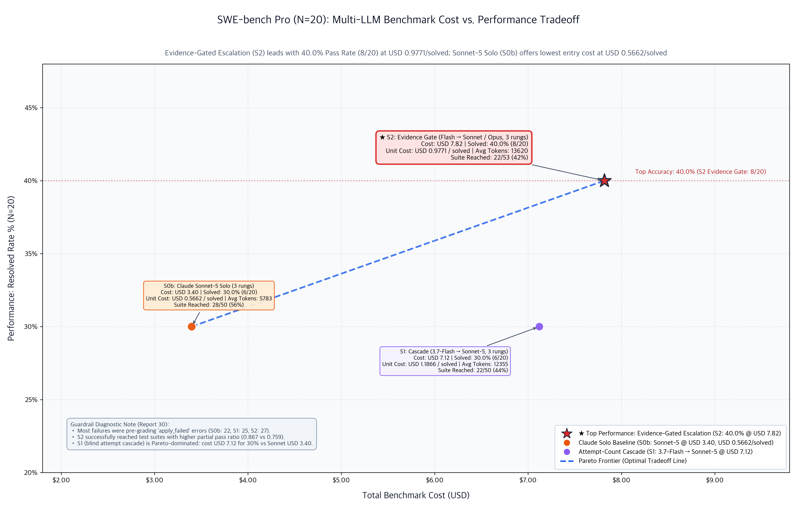

# Multi-LLM Benchmark Suite for Tokenomics & Straitjacket

[](https://www.python.org/downloads/)
[](LICENSE)
[](reports/README.md)
[](docs/straitjacket-implementation.md)

**Question this repository answers:** when a coding agent's tests fail, how
should the failure reach the next model — and what does each answer cost?

It benchmarks multi-LLM collaboration architectures (cascades, advisor/executor
splits, escalation ladders) against single frontier models on real software
engineering tasks, holding everything constant except one variable: how failing
test output is delivered to the repair turn. Models run live on Google Cloud
Vertex AI (Gemini) and Anthropic (Claude). Every sweep that carries a finding
here is a live API run priced from its own usage records, with zero simulated
tasks — the runner refuses rather than fabricating when a call fails, and stamps
any deliberately simulated call so it stays visible. The one pre-2026-08 report
that predates that policy is flagged as such in
[§1's caveats](#caveats-worth-stating-plainly).

---

## TL;DR — five things this repository measured

1. **Gate the frontier model on *evidence*, not on a failure counter.** Reading
   the harness's typed failure digest and escalating when it says `broad` or
   `stalled` reached **96% of a frontier-only pass rate for 74% of its spend**
   (BigCodeBench-Hard, all 148 tasks).
2. **Turning a cheap model's thinking budget up is the most expensive mistake
   on the board.** `gemini-3.7-flash` at `medium` cost **33% more than
   `claude-opus-5` and solved 14 fewer tasks**. Escalate the *model*, not the
   *thinking level*.
3. **A cheap ladder in front of a frontier model bought nothing** at a
   three-attempt budget — identical pass rate, identical cost per solved task.
   The saving people expect from "reserve the expensive model" did not appear.
4. **Sorting sub-tasks by labelled difficulty before anything runs lost to a
   flat, cheap control** on both accuracy and cost (ClassEval, 91 classes).
   Spend committed against a prior loses to spend committed against an oracle
   that already executed.
5. **`$/solved` is not a model property.** `claude-sonnet-5` was the *cheapest*
   arm per solved task on BigCodeBench-Hard and the *most expensive* on
   FeatureBench. Re-derive it per dataset; never transplant it.

The mechanism behind all five is one sentence: **a test run you already paid for
is a free, exact routing signal — use it, and stop buying rungs it says will
fail.**

Claims 1–4 are recomputable offline from checked-in raw records — the analyzer
for each is named beside it in [§1](#1-key-takeaways--best-setting). Three of
the five are negative results.

**The scope limit, stated once and meant:** every load-bearing number here was
measured where running the tests is **free, instant and exact** — the regime
that most favours "escalate on failure". Where retry costs a container run there
is a direction and no result yet
([§1](#what-swe-bench-pro-says-so-far-directional)). The full caveat list is
[here](#caveats-worth-stating-plainly), and it is worth reading before quoting
any row.

---

## The datasets, and what each one is for

Four datasets, chosen so that each can *falsify* what the previous one
suggested rather than agree with it.

| Dataset | A task is… | Graded by | Oracle cost | Why it is here | Status |
|---|---|---|---|---|---|
| **BigCodeBench-Hard** (148 rows, ships in-repo) | one Python function body, ~305-token prompt, ~6 unit tests | local sandbox, `pass`/`fail` | **free**, milliseconds | The main sweep. Nothing to decompose and a free exact oracle — the regime that most favours *fail → escalate* | ✅ complete dataset swept, 11 arms |
| **ClassEval** (100 classes, 92 scorable here) | a class of ~4 methods, each with its own test class and a labelled dependency tier | local sandbox, per method **and** per class | **free** | Adopted to *break* the BCB-Hard result: it has genuine sub-tasks of unequal, dataset-labelled difficulty | ✅ 91 classes, 9 arms |
| **SWE-bench Pro** (731 rows, 4 languages) | a real multi-file patch to a real repository | **upstream's own** image, restore command, run script and parser | **expensive** — a container test run per attempt | The first gradable test of H2: does escalation still win when the routing signal stops being free? | ⚠️ N=20 python only — directional, not significant |
| **FeatureBench** (100-row fast split) | a multi-file feature inside the repository's container | pytest inside the container, after a locally rebuilt test tree | **expensive** | Adopted for H2 first; its rows are only scorable when a local `test_patch` applies, which failed for *every* arm on most rows | ❌ N=48 ran but is **confounded** — do not rank its arms |
| WebDev | a BigCodeBench-Hard row filtered by web/networking imports | same as BCB-Hard | free | **Not an independent dataset** — see the caveat in §1 | — a subset, not a fifth observation |

**BigCodeBench-Hard and ClassEval are the two genuinely independent
observations here.** They were picked to disagree — one function with one
verdict, versus a class of independently-scored methods with labelled per-method
difficulty. They did not disagree.

---

## Quickstart

```bash
python3 -m venv .venv && source .venv/bin/activate
pip install -r requirements.txt
gcloud auth application-default login
export GCP_PROJECT="your-gcp-project-id" GCP_LOCATION="global"
```

```bash
python3 -m src.straitjacket          # verify the harness before spending anything
```

```bash
# Smoke test: 5 tasks, one cheap variant. ~$0.02. Confirms credentials end to end.
python3 run_benchmark.py --dataset bcb --n 5 --variants single_flash_lite --report
```

```bash
# Reproduce the headline table from checked-in raw records -- no API calls, no cost.
python3 tools/analyze_router_study.py     # BCB-Hard N=148  (the routing result)
python3 tools/analyze_classeval.py        # ClassEval N=91  (the sub-task result)
python3 tools/analyze_patterns.py         # BCB-Hard N=100  (the pattern families)
```

Full setup is [§2](#2-setup); every dataset's exact commands are
[§3](#3-run-a-benchmark). BigCodeBench-Hard needs nothing but credentials;
ClassEval needs a `pip install` plus a preflight; SWE-bench Pro and FeatureBench
need Docker and tens of GB of disk.

---

**New here? Read in this order.**

| | |
|---|---|
| 1 | [Key takeaways & best setting](#1-key-takeaways--best-setting) — **start here**: the N=148 full-dataset routing result, and the two negative findings inside it |
| 2 | [Why cascades suit BigCodeBench-Hard](#why-the-cascade-shape-suits-this-dataset) — which architecture pattern wins, and the mechanism behind it |
| 3 | [What ClassEval was run to falsify](#what-classeval-was-run-to-falsify) — the same question on a dataset built to give the other answer |
| 4 | [What SWE-bench Pro says so far](#what-swe-bench-pro-says-so-far-directional) — the same question again, where the oracle costs money |
| 5 | [Run a benchmark](#3-run-a-benchmark) — exact files and commands |
| 6 | [Routing study](docs/routing-study.md) — the full N=148 design and its §5 result |
| 7 | [Pipeline architecture](docs/pipeline-architecture.md) — how a task flows through the system |
| 8 | [Straitjacket implementation](docs/straitjacket-implementation.md) — what it is, and how it differs from upstream |
| 9 | [Report index](reports/README.md) — every sweep, in execution order, with the defective ones labelled |
| 10 | [Dataset selection for pattern tests](docs/pattern-dataset-selection.md) — where a non-cascade pattern could win, which datasets can show it, and the ClassEval verdict |
| 11 | [SWE-bench Pro setup](docs/swebench-pro-setup.md) — the Docker-backed dataset whose grading is the benchmark's own |
| 12 | [FeatureBench setup](docs/featurebench-setup.md) + [N=48 lessons](docs/featurebench-n48-lessons.md) — **the run happened, and it did not settle H2**: what a confounded sweep looks like, and the six rules it produced |

**Which sweeps carry which claim:**

| Sweep | Scope | Question it answers | Weight |
|---|---|---|---|
| **BCB-Hard N=148** ([report 19](reports/19_bcb-hard_straitjacket_n148.md)) | the **complete** dataset, 11 arms | how should a frontier model be *gated* behind cheap ones? | load-bearing |
| **BCB-Hard N=100** ([report 12](reports/12_bcb-hard_straitjacket_n100.md)) | 100-task slice, 7 arms | which *pattern family* wins — cascade, plan-execute, or collaboration? | load-bearing |
| **ClassEval N=91** ([report 17](reports/17_classeval_opus5_n91.md)) | 91 of 92 scorable classes, 9 arms | does routing *sub-tasks* by labelled difficulty pay? | load-bearing |
| **SWE-bench Pro N=20** ([report 31](reports/31_swebench-pro_straitjacket_n20.md)) | 20 python rows, 4 arms | does any of it survive an oracle that costs money? | **directional only** — nothing significant |
| FeatureBench N=48 ([20](reports/20_featurebench_straitjacket_n48.md), [22](reports/22_featurebench_straitjacket_n48.md)) | 48 rows, 8 arms | (same question) | **confounded — do not rank** |

---

## 1. Key takeaways & best setting

### The headline: gate the frontier model on evidence, not on a counter

From **BigCodeBench-Hard at N=148 — every task in the dataset, no sampling**
([report 19](reports/19_bcb-hard_straitjacket_n148.md)). Every arm gets the same
three-rung repair budget, so the routing policy is the only variable:

| Arm | Pass rate | Total cost | **$ / solved** | Opus called on | Opus yield |
|---|---|---|---|---|---|
| `r6_opus_after_ladder` — Opus only after every Gemini rung fails | **84.5%** | $5.65 | $0.0452 | 29% | 47% |
| `r0b_opus5_solo` — `claude-opus-5` × 3, no ladder | **84.5%** | $5.70 | $0.0456 | — | — |
| `r8_opus_after_2` | 84.5% | $5.84 | $0.0467 | 35% | 56% |
| `r10_opus_fresh_solve` — Opus re-solves instead of repairing | 82.4% | $5.08 | $0.0417 | 27% | 35% |
| **`r9_opus_on_evidence` — escalate when the digest says the failure is hard** | **81.1%** | **$4.24** | **$0.0353** | 45% | **58%** |
| `r7_opus_after_1` — escalate on the first failure | 75.7% | $5.58 | $0.0498 | 59% | 59% |
| `r5_gemini_think_ladder` — 3.7 low → medium → high | 75.7% | $7.55 | $0.0674 | — | — |
| `r2_f37_medium` — `gemini-3.7-flash` (medium) × 3 | 75.0% | $7.60 | $0.0684 | — | — |
| `r4_gemini_ladder` — Lite → 3.7 low → 3.7 medium, no Opus | 73.0% | $3.90 | $0.0362 | — | — |
| `r1_f37_low` — `gemini-3.7-flash` (low) × 3 | 71.6% | $4.27 | $0.0403 | — | — |
| `r0a_sonnet5_solo` — `claude-sonnet-5` × 3 | 66.9% | $2.86 | $0.0289 | — | — |

**Oracle ceiling across all eleven arms: 135/148 (91%).** Thirteen tasks were
solved by nothing.

### Three results, and two of them are negative

**1. A high-thinking Gemini rung costs more than Claude Opus-5 and scores
worse.** This is the most actionable number in the repository:

```
gemini-3.7-flash (medium) x3   111/148 (75.0%)   $7.60   6,513 avg output tokens
claude-opus-5 x3               125/148 (84.5%)   $5.70   1,221 avg output tokens
```

33% more money for 14 fewer solved tasks. The premise of a budget ladder is that
the cheap tier is cheap; at `medium` thinking on this dataset it is not, because
it emits 5.3× the output tokens the frontier model does. **Thinking budget, not
model tier, is the dominant cost term once it is turned up.**

**2. Putting a Gemini ladder in front of Opus saved nothing.**
`r6_opus_after_ladder` reaches *exactly* Opus-solo's 125/148 at **99% of its
cost per solved task**. `r8` is the same pass rate and slightly more expensive.
Given three attempts, Opus solves the tasks the ladder would have reached
anyway, and the ladder's rungs are overhead on the tasks it cannot. The
reserve-the-frontier-model intuition that the N=100 slice supported at a
two-attempt budget **does not survive a three-rung budget on the full dataset**.

**3. The evidence gate is what actually pays — by escalating *more*, not less.**
`r9_opus_on_evidence` reads the harness's typed failure extraction
([`src/routing.py`](src/routing.py)) and jumps to Opus when the digest says the
failure is `broad` or `stalled`. It reaches **96% of Opus-solo's pass rate for
26% less total spend**, the best `$/solved` of any arm above 70%.

The mechanism is not the one the study predicted. `r9` calls Opus on **45%** of
tasks against `r6`'s 29% — it escalates *more often* and is cheaper anyway,
because firing the gate at rung 1 or 2 **skips the `gemini-3.7-flash (medium)`
rung that was going to fail** — the tier result 1 shows costs more per task than
Opus. The saving comes from not buying a doomed expensive rung, not from
rationing the frontier model. Its gate is also the most selective: 58% of what
it escalated got solved, against 47% for `r6` and 35% for `r10`.

**And a fourth, smaller one:** `r10_opus_fresh_solve` discards the failed
candidate and re-solves from scratch. Its frontier yield is the worst on the
board — 35% against `r6`'s 47% at comparable call volume. **Do not throw the
failing candidate away when you escalate**; the digest is worth more than the
anchoring costs.

### Best setting depends on what you are optimising

| If you want… | Use | Why |
|---|---|---|
| **Best accuracy per dollar — the recommended default** | `r9_opus_on_evidence` | 81.1% at **$0.0353/solved**; 96% of frontier accuracy for 74% of frontier spend |
| **Highest accuracy** | `r6_opus_after_ladder` or plain `r0b_opus5_solo` | 84.5% either way — if you are paying for Opus anyway, the ladder in front of it is optional |
| **Cheapest that still works** | `r0a_sonnet5_solo` | $0.0289/solved, but only 66.9% |
| **No frontier budget at all** | `r4_gemini_ladder` | 73.0% at $0.0362/solved — and note it beats both high-thinking Gemini arms on cost *and* one of them on accuracy |

Reproduce the table with:

```bash
python3 tools/analyze_router_study.py
```

Full design, gate definitions and the per-block reasoning:
[routing study](docs/routing-study.md).

### The pattern-family comparison (N=100)

A separate, earlier sweep over a 100-task slice asked a different question —
which *shape* of multi-model architecture wins — with a two-attempt budget. Its
arms are not comparable to the N=148 rows above (different task set, different
repair budget), and it is kept because it is the only sweep that put cascades,
plan-and-execute and collaboration side by side:

| Configuration | Pass rate | Total cost | **$ / solved task** |
|---|---|---|---|
| Single: `claude-opus-5` | **76%** | $3.52 | $0.0463 |
| Straitjacket Escalation Shield | 68% | $1.92 | **$0.0282** |
| Straitjacket Cascade | 66% | $2.23 | $0.0339 |
| Straitjacket Smart Repair | 64% | $2.72 | $0.0425 |
| Single: `gemini-3.7-flash` | 60% | $2.23 | $0.0372 |
| Straitjacket Hybrid | 59% | $1.63 | **$0.0277** |
| Single: `claude-sonnet-5` | 54% | $1.54 | $0.0285 |

`claude-opus-5` at 76% here and 84.5% at N=148 are not in conflict: two
variables differ, the task set and the repair budget (two attempts vs three).

### How much headroom is actually left

On the complete dataset, across all eleven N=148 arms, the union of everything
solved is **135/148 (91%)** — thirteen tasks are out of reach for every model
and every ladder tested. The best single arm reaches 84.5%, so **the accuracy
headroom left to any router is about 6 points.**

That is why the N=148 result reads as it does: routing on this dataset is
overwhelmingly a *cost* play, and the arm that wins on cost (`r9`, $0.0353 vs
$0.0456) gives up 5 of those 6 points to get there. Anything reporting above 91%
here would be a measurement error, not a breakthrough.

The earlier 100-task slice showed the same shape at lower absolute numbers, and
is where the pairwise decomposition was done:

```
solved by gemini-3.7-flash but not claude-opus-5 :  3
solved by claude-opus-5 but not gemini-3.7-flash : 19
solved by both                                   : 57
solved by NEITHER                                : 21
────────────────────────────────────────────────────
perfect flash|opus router ceiling                : 79
union of all seven arms                          : 87
```

That observation is what the [routing study](docs/routing-study.md) was built to
exploit, and §5 of it reports what happened when it did.

### Why the cascade shape suits this dataset

Three families of multi-model architecture were run over the same tasks. They
differ in **when** the extra model is paid for, relative to the first piece of
evidence about whether the task is actually hard:

| Pattern | When the extra model is spent | Arms |
|---|---|---|
| **Cascade / escalation** | *after* the tests fail — one attempt at a time, each next turn handed to a different model | `sj_cascade`, `sj_escalation_shield`, `sj_smart_repair` |
| **Planning & executing** | *before* anything runs — a planner writes guidance, a cheap executor implements it | `sj_hybrid`, `combo_read_write`, `G3` (N=50) |
| **Collaboration** | *before and across* — several candidates, then a synthesis turn reconciling them | `G4` dual-candidate verifier (N=50), `sj_dual_verifier` |

Every number below is recomputed from the raw result records by:

```bash
python3 tools/analyze_patterns.py
```

**The one measurement that is decisive.** Splitting each arm by which turn
solved the task isolates what the repair budget actually buys. `repair_loops=0`
means the first attempt passed, so the rescue rate is measured only over the
tasks that arm itself failed:

| Arm | First attempt | Model on 1st repair | Rescued by 1st repair | Model on 2nd repair | Rescued by 2nd |
|---|---|---|---|---|---|
| `sj_escalation_shield` | 31/100 | flash ↑ from lite | **28/69 = 41%** | `claude-sonnet-5` ↑ | 9/41 = 22% |
| `sj_cascade` | 32/100 | flash ↑ from lite | **28/68 = 41%** | flash again → | 6/40 = 15% |
| `sj_hybrid` (plan+exec) | 37/100 | flash ↑ from lite | 22/63 = 35% | — (no 2nd turn) | — |
| `sj_smart_repair` | 32/100 | lite ↓ **from flash** | **11/68 = 16%** | flash (medium) ↑ | 21/57 = 37% |
| `single_flash37` | 35/100 | flash → itself | 25/65 = 38% | — | — |
| `single_sonnet5` | 42/100 | sonnet → itself | 12/58 = 21% | — | — |
| `single_opus5` | 56/100 | opus → itself | 20/44 = 45% | — | — |

`sj_smart_repair` is the control that makes this readable: it is structurally a
cascade, but its first repair turn *de-escalates* (`gemini-3.7-flash` →
`gemini-3.5-flash-lite`). Its rescue rate collapses to 16% against the 41% of
the arms that escalate upward — **z = +3.55, p = 0.0004** — and recovers to 37%
on the next turn, the moment the ladder points up again. The repair turn's
rescue rate tracks the *capability of the model holding that turn*, and almost
nothing else.

**Two structural properties of BigCodeBench-Hard explain the rest.** Measured
over the same 100 tasks (`src/datasets.py`):

```
prompt fed to the model    mean 305 tok   median 278   max 863
gold solution              mean 174 tok   median 162   max 378
unit tests per task        mean   6       median   5   min   3
third-party libs per task  mean   3       median   3   max   6
```

1. **There is nothing to decompose.** Spec, solution and test suite together fit
   in under 2K tokens, and every task is a single function body. A planner
   cannot partition work that was never partitioned; on this dataset its output
   is largely a restatement of the docstring. That is why the planning premium
   lands almost entirely on the first attempt (37/100 for `sj_hybrid` vs 32/100
   for bare lite) and buys nothing afterwards.
2. **There is a free, exact oracle on every turn.** Roughly six executable unit
   tests per task return ground truth for $0. A cascade converts that oracle
   directly into a routing decision — *fail → escalate* — so the expensive model
   is bought only where the tests have already proved it is needed. A
   collaboration turn has to *replace* that oracle with a model's judgment about
   which candidate is better, which is a strictly weaker signal than simply
   running the tests. A planner spends before any oracle signal exists at all.

**The economics follow directly.** Counting actual calls to the premium model:

```
sj_hybrid   (plan & execute) : 163 gemini-3.7-flash calls  (100 planner, unconditional
                                + 63 repair)                → 59/100
sj_escalation_shield         :  69 gemini-3.7-flash calls
                                + 41 claude-sonnet-5 calls  → 68/100
                               (both conditional on a test failure)
```

The plan-and-execute arm bought 2.4× more premium turns than the escalation
shield and finished nine points lower, because 100 of its 163 premium calls were
committed against a prior rather than against evidence.

**What the data does *not* license.** Only the escalation-direction result above
clears significance at N=100. The pattern-level gaps do not: `sj_escalation_shield`
68% vs `sj_hybrid` 59% is p = 0.19; the first-repair 41% vs 35% is p = 0.42; the
planner's first-attempt lift (37 vs 32) is p = 0.46. The cascade arms also get
three attempts to `sj_hybrid`'s two, and that budget difference is a genuine
confound — comparing only the first repair turn is what controls for it. The
N=50 Gemini-vs-Claude sweep ranks the same way (escalation `C2` 38% / cascade
`G2` 36% > collaboration `G4` 34% > single-model repeat `G1` 30% > planning
`G3` 28%) but every one of those gaps is inside binomial noise at that size.

So the defensible claim is narrow and useful: **on BigCodeBench-Hard the return
comes from what the next turn escalates *to*, not from how much reasoning is
front-loaded before the first turn.** One suggestive detail from `G4` fits it —
its second candidate, an independent resample from the *same* model, rescued
**0 of 39** failures, while the stronger synthesis model that followed rescued 6.
Resampling changes the sample; escalation changes the ceiling.

### What ClassEval was run to falsify

The BigCodeBench-Hard result above is conditional on two properties of that
dataset, both measured rather than assumed: there is nothing to decompose, and
the oracle is free. Stated as a conditional, it makes a prediction that can
fail:

> **H1.** When one task contains several sub-tasks of *unequal* difficulty,
> assigning sub-tasks to models **by difficulty** should beat a cascade at equal
> spend — because a cascade can only escalate the *whole* task, and so pays
> frontier prices on the easy sub-tasks it re-solves on the way up.

ClassEval was adopted specifically to give H1 its best shot. A task is a class of
~4 methods; 71 of its 100 classes span more than one difficulty tier; the tiers
come from the dataset's own `dependencies` annotation rather than from a guess
made here; and every method ships its own test class, so a pass is attributable
to the model that wrote *that method*. The reasoning is in
[dataset selection for pattern tests](docs/pattern-dataset-selection.md).

**The sweep: nine arms, 91 of the 92 scorable classes, 376 scorable methods,
live API**
([report 17](reports/17_classeval_opus5_n91.md); recompute with
`python3 tools/analyze_classeval.py`):

| Arm | Class pass | Method pass | Total cost | **$ / solved** | Integration gap |
|---|---|---|---|---|---|
| `ce_single_opus` — frontier baseline | **80/91 (88%)** | 357/376 | $3.71 | $0.0464 | 0 |
| `ce_cascade` — **the shape to beat** | 73/91 (80%) | 341/376 | $2.71 | $0.0371 | 0 |
| `ce_single_flash` | 70/91 (77%) | 334/376 | $2.16 | $0.0308 | 0 |
| `ce_plan_exec` | 70/91 (77%) | 333/376 | $1.86 | $0.0266 | 0 |
| `ce_single_sonnet` | 66/91 (73%) | 332/376 | $1.93 | $0.0293 | 0 |
| `ce_route_flat` — **the control** | 66/91 (73%) | 340/376 | $1.39 | **$0.0210** | 1 |
| `ce_route_by_tier` — **the hypothesis** | 65/91 (71%) | 341/376 | $2.06 | $0.0317 | 1 |
| `ce_plan_route` | 65/91 (71%) | 337/376 | $2.66 | $0.0410 | 1 |
| `ce_single_lite` | 56/91 (62%) | 313/376 | $0.40 | **$0.0072** | 0 |

**H1 is not supported.** The routed arm reaches 71% against the cascade's 80%
(z = −1.39, p = 0.17 — that gap is itself inside noise at this N), and it does
not buy the shortfall back on cost at a matched pass rate: $0.0317 vs $0.0371 is
1.17× cheaper for nine points less accuracy. H1 predicted a win at
matched-or-better accuracy, and there is no reading of the table that produces
one.

**The control is the harsher half.** `ce_route_flat` runs the identical
per-method loop with *every* method written by the cheapest model — same repair
policy, same call counts, same prompts; the only difference from the hypothesis
arm is the one function that picks the model. It lands one
class *above* the routed arm — 66/91 to 65/91 — at **34% lower cost per solved
task**, spending $0.67 less in total. So whatever
writing a class method-by-method is worth here, sorting those methods by
difficulty subtracts from it. Adding a planner on top (`ce_plan_route`) is worse
again — same 65/91, $0.0410 per solved. Without that control, `ce_route_by_tier`
beating a whole-class single model would have been readable as a win for
difficulty routing; it is not, and `tools/analyze_classeval.py` refuses to bless
a result whose control is missing from the sweep.

**Why the routing spend does not convert.** Per-model delivery inside
`ce_route_by_tier`: `gemini-3.5-flash-lite` delivered **206 of the 207 methods
routed to it**; `gemini-3.7-flash` 129/146; `claude-sonnet-5` 6/23 at $0.51.
That last row is not a frontier model failing — sonnet only ever holds a
*repair* turn one rung above flash, so 6/23 is a rescue rate on the residue two
cheaper rungs already failed. The cheap rung was never the bottleneck the
hypothesis assumed. It delivers essentially everything sent to it, and the cost
sits in a hard tail that no routing *policy* reaches, because reaching it needs
a better model rather than a better assignment.

The per-tier breakdown says the same from the other side. On `method_dep`, the
hardest tier and the one the routing table sends up to `gemini-3.7-flash` at
medium thinking, the routed arm scores 85/102 against the cascade's 90/102 and
opus's 94/102. Routing a method to a stronger model does not help when what
makes the method hard is its dependence on *the other methods in the same
class* — which a per-method prompt cannot show it.

**One failure mode belongs only to decomposition.** All three per-method arms
carry exactly one class where every method passed its own test and the assembled
class still failed; every whole-class arm carries none. One in 91 did not decide
this result, but it is the cost that only splitting a task can incur, and it is
worth watching on a dataset with wider classes.

**What the two datasets agree on.** BigCodeBench-Hard says the repair turn's
value tracks the rung it escalates *to*. ClassEval says a difficulty label
chosen before anything runs does not substitute for that. Both point at the same
mechanism: *fail → escalate* routes on an oracle that has already executed,
while difficulty routing and front-loaded planning both commit spend against a
prior. Opus-5 remains the accuracy ceiling on both slices (76% and 88%), and on
both it is the most expensive thing per solved task.

### What SWE-bench Pro says so far (directional)

Both results above were measured where failing is **free**. SWE-bench Pro is the
first dataset here whose oracle costs real money and real minutes — an attempt
applies a patch inside the repository's own container and runs that
repository's suite through upstream's own run script and parser. That makes
**H2** testable:

> **H2.** As the oracle gets more expensive, the cascade's advantage shrinks,
> because *fail → escalate* stops being a free routing signal and
> front-loaded planning finally pays.

**20 python rows, four arms, three container test runs each**
([report 31](reports/31_swebench-pro_straitjacket_n20.md)):

| Arm | Resolved | Total cost | $ / solved | Attempts that reached the suite |
|---|---|---|---|---|
| `sbp_evidence_gate` — escalate on the digest (`r9` shape) | **8/20 (40%)** | $7.82 | $0.977 | 22/53 (42%) |
| `sbp_single_sonnet` — `claude-sonnet-5` × 3 | 6/20 (30%) | **$3.40** | **$0.566** | 28/50 (56%) |
| `sbp_cascade` — escalate on the failure count (`r6` shape) | 6/20 (30%) | $7.12 | $1.187 | 22/50 (44%) |
| `sbp_plan_exec` — **the H2 challenger**: Opus plans, flash implements | 5/20 (25%) | $5.52 | $1.104 | 11/52 (21%) |

**The ranking is the one BCB-Hard predicted** — evidence gate above cascade
above plan-and-execute — and the H2 challenger is last. That is the whole of the
good news.

**Nothing here is significant.** Every pairwise Fisher exact test is p ≥ 0.50
(the widest gap, 8/20 vs 5/20, is p = 0.50), and the 95% CIs run 22–61% for the
best arm and 11–47% for the worst. Twenty rows cannot separate four arms this
close. **These rows do not belong in a table with the N=148 rows**, and this
section is written to be quoted as a *direction*, not a result.

**Two things it does establish, both about measurement rather than routing:**

- **The cost position inverted exactly as predicted.** With no expensive middle
  rung to skip, the evidence gate stopped being the cheap arm and became the
  most expensive multi-model arm on the board — $0.977/solved against sonnet
  solo's $0.566. The [tokenomics-architect skill](.agents/skills/tokenomics-architect/SKILL.md)
  §6 wrote that inversion down as a prediction before the run; it held. The open
  question is whether the extra resolved tasks are worth it, and N=20 cannot say.
- **The dominant failure is still the patch, not the routing.** 42–56% of
  attempts died at `apply_failed` before any test ran, and `sbp_plan_exec`
  reached the suite on only 21% of its attempts. An arm's pass rate here is
  partly a measure of whether it can emit a diff `git apply` accepts. Read the
  attempt-diagnostics column in the report before reading the pass rate.

**H2 is therefore still open**, and the honest scope of everything above it is
unchanged: *evidence-gated escalation is the default **where retry is cheap**.*
What would close it is the same sweep at N ≥ 100 on one language, with the
apply-failure rate driven down first — the arms and the harness already exist.

### Caveats worth stating plainly

- **These are with-test-feedback numbers, not leaderboard numbers.** Every arm
  feeds its repair turn a digest of the *same* test suite that produces the
  final grade — test names, docstrings, assertion messages. That is the point of
  the experiment (the question is how failing test output should reach the next
  model), and it is fair across arms: identical access, identical attempt
  budget. But published BCB-Hard and ClassEval figures are typically single-shot,
  so **84.5% for `claude-opus-5` here is not comparable to a public leaderboard
  row.** Compare arms to each other, never to a leaderboard. It also constrains
  which datasets can be added next — see
  [docs/pattern-dataset-selection.md §7.2](docs/pattern-dataset-selection.md).
- **Containment is not free accuracy.** Replacing a paid triage model with the
  harness's digest removes 100% of triage spend ($0.0000 vs ~$0.0018/repair).
  It does not by itself raise pass rates; it lowers the cost of reaching them.
- **Containment does nothing when there is nothing to contain.** A failure whose
  whole output is a handful of lines shows a delta at or below zero, and the
  reports print that as readily as a win.
- **The N=148 run checks out, with one asterisk.** Backend `library`,
  `ctx-harness` 0.35.1, zero simulated tasks, all eleven arms complete over all
  148 tasks. The asterisk: `r9_opus_on_evidence` records
  `routing.degraded = true` on 11 of 148 tasks, where one attempt produced a
  capture with no typed fact tier and the gate declined to escalate for want of
  evidence. It does not explain `r9`'s 5-task gap to `r6` — both solve 3 of
  those 11, and only 1 of `r6`'s 9 exclusive wins is among them. Detail in
  [routing study §5.5](docs/routing-study.md).
- **Attempt budget is a variable, and it is not held constant across sweeps.**
  The N=148 router arms get three rungs; the N=100 pattern arms get two. That
  alone moves `claude-opus-5` from 76% to 84.5%, so **rows from different sweeps
  must never be put in one table.** Within a sweep every arm has the same budget,
  which is what makes the arm-vs-arm comparisons sound.
- **148 tasks on one dataset, 91 on the other.** Differences of a few points are
  within noise on both; the N=148 spread from 66.9% to 84.5% is not.
- **Report 11's BigCodeBench-Hard N=50 table does not reconcile with its own raw
  results.** It prints 30/47, 36/47, 37/47, 39/47 where the archived per-arm
  JSONs (`bigCodeBench-hard/results/n50_*.json`) record 15/50, 18/50, 14/50 and
  16/50. It also predates the *refuse rather than fabricate* failure policy in
  `src/client.py`, so its numbers may include simulated calls. The N=50 figures
  quoted above are read from those raw JSONs, not from the report.
- **WebDev is not a third dataset.** `load_webdev_problems` filters
  BigCodeBench-Hard rows by web/networking library imports
  ([src/datasets.py](src/datasets.py)), so it repeats the same task shape on a
  subset rather than testing a new one. Any claim leaning on BCB-Hard *and*
  WebDev is leaning on one dataset twice. BigCodeBench-Hard and ClassEval are the
  two genuinely independent observations here.
- **SWE-bench Pro was deleted once, then re-adopted on different terms.** The
  first version was never executed: a candidate patch was scored by
  substring-matching it against the canonical patch's first added lines, and the
  local dataset file had empty `FAIL_TO_PASS`/`PASS_TO_PASS`. Every number it
  produced was a canonical-patch similarity proxy printed in a column labelled
  "pass rate", so the dataset, its arms and its three reports (indices 07–09)
  were removed rather than annotated
  ([docs/pattern-dataset-selection.md §3](docs/pattern-dataset-selection.md)).
  **The current SWE-bench Pro path is a different implementation**: upstream's
  own per-instance image, restore command, `run_script.sh` and `parser.py` decide
  every verdict ([`src/evaluator.py`](src/evaluator.py)), and nothing from the
  deleted version was carried forward. Reports 21 onward are that harness. When
  reading anything written before 2026-08-25 about "no executed multi-file-patch
  dataset", it refers to the deleted version.
- **SWE-bench Pro reports 21 and 23 must not be ranked either.** They ran at
  `SBP_MAX_ORACLE_CALLS = 2`. Each gate is evaluated once per repair turn and
  compares the attempt index against a two-entry ladder, so at a two-call budget
  no gate can answer "escalate" and the frontier rung is unreachable code for
  every arm that names one — the same structural defect as FeatureBench report
  22. Their arms also cover different task counts (37–50), so they were never
  scored over one task set. `routing.frontier_is_reachable` is now asserted over
  the registry, and reports 29–31 run at three calls. Read
  [report 31](reports/31_swebench-pro_straitjacket_n20.md), not 21 or 23.
- **FeatureBench N=48 is a confounded sweep, not a third finding.** Both reports
  are complete and live, and every defect below is visible in their own records:
  the oracle budget differs across arms (3 calls vs 2), four arms were replayed
  from a cache written under the older budget while their labels were rewritten
  for the newer one, three arms did not execute the architecture their row names,
  94% of failures are rejected diffs rather than failed tests, and no pairwise
  difference reaches p < 0.05. **Its rows belong in no comparison table.** Full
  audit: [docs/featurebench-n48-lessons.md](docs/featurebench-n48-lessons.md).
- **A cached record outlives the code that produced it.** `run_arm` replays any
  task already in the cache, and the cache carries no code version. Report 20 was
  generated after `MAX_ORACLE_CALLS` was halved and the arms renamed, from records
  produced before either change — so the report's labels describe code that never
  ran those rows. Use `--no-cache` whenever an arm definition or a shared constant
  has moved.
- **A generated report line can manufacture a winner.** `src/reporter.py` closes
  every report with "X is the cheapest per solved task; Y has the highest pass
  rate". On a dataset where every CI overlaps, that sentence ranks noise. Treat it
  as a pointer to the table, never as a conclusion.
- **`test_pass_ratio` was computed and then dropped.** `src/featurebench.py`
  returns the partial-credit metric that the setup doc argues is essential at a
  low resolve rate; the `src/sweep.py` allowlist that persisted these sweeps
  omitted it, so it reached no result file and no report. Reports 20 and 22 have
  only the binary verdict, whatever the allowlist carries from here on.
- **The ClassEval result is a failure to find an effect, not a proof of zero.**
  Every per-arm gap in that table is individually inside binomial noise at N=91.
  What is defensible is narrower and still useful: H1 made a directional
  prediction with a specific cost signature, and neither the direction nor the
  signature showed up — including against its own one-model control.
- **ClassEval's scorable set is environment-specific.** 8 of the 100 classes are
  quarantined because *gold itself* cannot pass them on this machine, leaving 92;
  the sweeps above ran 91 of those. Regenerate
  `classeval/data/quarantine-test.json` per machine — copying it between machines
  makes two boxes measure different task sets while reporting comparable-looking
  pass rates.

**What is still untested.** Both datasets carrying *load-bearing* findings here
— BigCodeBench-Hard and ClassEval — run their tests in a sandbox for $0, so
*escalate on failure rather than plan in advance* has only ever been
**established** where the failure signal is free, instant and exact: the regime
that most favours it. The open question is what happens when retry is expensive
or the oracle is partial.
[Dataset selection for pattern tests §7](docs/pattern-dataset-selection.md)
ranks the candidates and named one — **FeatureBench's fast split** — as the run
that would settle it.

**That run has happened twice, and H2 is still open.**

1. **FeatureBench N=48 did not settle it.** The diff-application step, not the
   routing policy, determined almost every outcome, and the arms did not share
   an oracle budget. Six conditions on the rerun are derived in
   [docs/featurebench-n48-lessons.md §8](docs/featurebench-n48-lessons.md),
   starting with: return the `git apply` output as evidence, hold one oracle
   budget and assert it, and refuse to tabulate any row whose distinguishing
   branch never fired.
2. **SWE-bench Pro N=20 did not settle it either, for a better reason.** Those
   six conditions are met — one oracle budget, asserted reachable; the apply log
   returned as evidence; upstream's own grading — and the arms ranked exactly as
   the cheap-oracle result predicts, with the H2 challenger last. But at twenty
   rows every pairwise gap is p ≥ 0.50, and 42–56% of attempts still died before
   a test ran. See [§1](#what-swe-bench-pro-says-so-far-directional).

So the scope limit stands as written: **evidence-gated escalation is the default
where retry is cheap**, and the expensive-oracle regime has a direction but no
result. Closing it means the same SWE-bench Pro sweep at N ≥ 100 on one
language, with the apply-failure rate driven down first.

---

## 2. Setup

```bash
python3 -m venv .venv
source .venv/bin/activate
pip install -r requirements.txt        # includes ctx-harness, the straitjacket harness
```

```bash
gcloud auth application-default login
export GCP_PROJECT="your-gcp-project-id"
export GCP_LOCATION="global"           # or us-central1
```

Verify the harness before spending money on a sweep:

```bash
python3 -m src.straitjacket
```

It prints backend status, runs two real captures, and performs a live bounded
retrieval. Model IDs and pricing live in [`MODELS.md`](MODELS.md).

---

## 3. Run a benchmark

**One entry point for every dataset:** [`run_benchmark.py`](run_benchmark.py).
The per-dataset directories contain data, results and historical scripts — you
do not need to run anything inside them.

### BigCodeBench-Hard

The dataset ships in the repository
(`bigCodeBench-hard/data/BigCodeBench-Hard-v0.1.4.jsonl`), so no download step
is needed.

```bash
# Smoke test: 5 tasks, one cheap variant. Confirms credentials and the harness.
python3 run_benchmark.py --dataset bcb --n 5 --variants single_flash_lite --report
```

```bash
# The headline sweep (report 12 was produced by this command).
python3 run_benchmark.py \
    --dataset bcb \
    --n 100 \
    --variants single_flash37,single_sonnet5,single_opus5,sj_cascade,sj_hybrid,sj_smart_repair,sj_escalation_shield \
    --report \
    --no-cache
```

```bash
# The ablation: identical models and prompts, only the evidence treatment differs.
# These are the rows that license any claim about containment.
python3 run_benchmark.py --dataset bcb --group ablation --n 30 --report
```

```bash
# Routing study: gemini-3.7-flash centric ladders with claude-opus-5 reserved
# for hard tasks. Ten arms; see docs/routing-study.md for what each one asks.
python3 run_benchmark.py --dataset bcb --group router --n 148 --report --no-cache
python3 tools/analyze_router_study.py
```

This is the sweep behind [report 19](reports/19_bcb-hard_straitjacket_n148.md)
and the headline in §1. It ran over the complete 148-task dataset and cost
**$58.27** for all eleven arms. `analyze_router_study.py` defaults to
`bigCodeBench-hard/results/bcb_router_results.json` — the file `--group router`
writes — and prints pass rate, `$/solved`, how often the frontier tier was
actually invoked, what fraction of those it solved, the Pareto frontier and the
oracle ceiling. Cheaper subsets are listed in
[docs/routing-study.md §4](docs/routing-study.md).

**`r9_opus_on_evidence` needs the library backend.** The typed fact tier is read
from the in-process manifest, so under `SJ_BACKEND=cli` there is nothing to gate
on and `r9` silently degrades into `r6`. The router detects this, warns, and sets
`routing.degraded = true` on every affected task — so check that flag before
quoting an `r9` row.

**Use `--no-cache` whenever you care about the containment receipt.** Cached
task records from older revisions have no containment field, and a cached run
silently produces an empty receipt.

Only run one sweep at a time. Concurrent runs write the same results file,
cache and reports, and the last one to finish wins.

### ClassEval — the sub-task routing experiment

BigCodeBench-Hard cannot test whether routing *sub-tasks* by difficulty pays,
because one of its tasks is one function with one verdict. ClassEval can: a task
is a class of ~4 methods, the dataset labels each method's dependency structure,
and every method ships its own test class — so a pass is attributable to the
model that wrote that method. The reasoning is in
[dataset selection for pattern tests](docs/pattern-dataset-selection.md); the
arms are in [`src/classeval.py`](src/classeval.py). **It has been run at N=91,
and the hypothesis lost** — the numbers and the mechanism are in
[§1, what ClassEval was run to falsify](#what-classeval-was-run-to-falsify).
What follows is how to reproduce it.

**Install the dataset's dependencies first.** ClassEval's tasks import ten
third-party packages. A package that is missing does not make a task unscorable
— it makes the *machine* unscorable, and quarantining those tasks would silently
shrink the benchmark so that two machines measure different task sets and their
pass rates stop being comparable. On a bare environment that is 12 tasks lost,
against 8 on the provisioned machine these runs used.

```bash
pip install -r classeval/requirements.txt
python3 tools/fetch_nltk_data.py --install
```

`nltk` needs data files that pip does not install, and **`nltk.download()` does
not work behind a proxy** — recent versions refuse a proxied fetch because they
cannot pin the validated IP when the proxy performs the egress
(`Security Violation [pathsec.urlopen] … CWE-918`). `fetch_nltk_data.py` pulls
the same package zips over ordinary HTTPS, which honours `HTTPS_PROXY` like any
other client, so it needs no opt-out of that security control. Which resources
it fetches is asked of the installed nltk rather than hardcoded — the ids moved
between releases (`pos_tag` wanted `averaged_perceptron_tagger` before nltk 3.9
and `averaged_perceptron_tagger_eng` after; `word_tokenize` moved from `punkt`
to `punkt_tab`), so any fixed list is wrong on some version. Run it without
`--install` to see what is missing first.

```bash
# Check without running anything: what the split imports, and what is missing here.
python3 tools/classeval_preflight.py --deps-only
```

The preflight refuses to run (exit 2) while a package is missing, and prints the
exact `pip install` line — pass `--accept-missing-deps` to proceed anyway and
take the smaller task set knowingly.

**Then run the preflight.** Even fully provisioned, a handful of classes cannot
be scored. On this machine that is 8 of the 100: two whose gold simply fails its
own tests, one written against NumPy 1.x, one that resolves a hostname, one
flaky random-map task, and three whose `methods_info` omits a method the class
needs. Left in, they are charged to the models — and that last group is charged
*only* to the per-method arms, which biases the exact comparison being made.
That leaves **92 scorable classes**; the sweeps reported here ran `--n 91`, so
they cover 91 of them.

```bash
python3 tools/classeval_preflight.py --write --repeat 3
```

It runs ClassEval's own gold solutions, and writes the tasks gold cannot pass to
`classeval/data/quarantine-test.json`, which the loader then honours. Tasks are
excluded, never edited, and each exclusion records its reason — a
`missing_module:PyPDF2` reason names the package, so it can be fixed rather than
accepted. **The quarantine file is environment-specific: regenerate it on each
machine, do not copy it between them.**

```bash
# Smoke test: 2 tasks, the hypothesis arm and the shape it has to beat.
python3 run_benchmark.py --dataset classeval --n 2 --variants ce_route_by_tier,ce_cascade
```

```bash
# The full comparison. Eight arms over 91 of the 92 scorable classes.
python3 run_benchmark.py --dataset classeval --group classeval --n 91 --report --no-cache
python3 tools/analyze_classeval.py
```

| Arm | What it is | N=91 result |
|---|---|---|
| `ce_single_lite` / `ce_single_flash` / `ce_single_sonnet` | one model writes the whole class, then repairs it | 62% / 77% / 73% |
| `ce_cascade` | **the shape to beat** — whole-class escalation, Lite → 3.7 low → 3.7 medium | **80%**, $0.0371/solved |
| `ce_plan_exec` | planner writes per-method contracts, a cheap executor writes the class | 77%, $0.0266/solved |
| `ce_route_flat` | **the control** — per-method generation, every method written by the same cheap model (repair still steps one rung up, as in every arm) | 73%, **$0.0210/solved** |
| `ce_route_by_tier` | **the hypothesis** — each method routed by its labelled difficulty tier | 71%, $0.0317/solved |
| `ce_plan_route` | contracts *and* difficulty routing | 71%, $0.0410/solved |
| `ce_single_opus` | the frontier baseline — **not** in `--group classeval`; see below | **88%**, $0.0464/solved |

`ce_route_flat` is not optional. Without it, a win for `ce_route_by_tier` cannot
be told apart from "writing the class method-by-method is better", which is a
different claim — `tools/analyze_classeval.py` refuses to bless the result if
the control is missing from the sweep. The tier labels come from the dataset's
own `dependencies` annotation, never from a guess made here.

#### The claude-opus-5 baseline

`ce_single_opus` is the same arm shape as the other singles, run on
`claude-opus-5`. It is deliberately excluded from `--group classeval`: opus is
priced 2.5× Sonnet-5 and 17× Gemini 3.7 Flash per output token, so including it
would reprice every routine sweep. Run it on its own and merge its row into the
sweep you already have:

```bash
# Runs only the opus-5 arm over the same 91 tasks, then merges its row into
# classeval/results/classeval_classeval_results.json and regenerates the reports.
python3 run_classeval_opus5.py --n 91
```

The run goes through the same `src/sweep.py` loop, task cache and scoring rules
as `run_benchmark.py`, so the row is comparable by construction. The merge
(`src/merge.py`) matches on variant `id`, so re-running the arm **replaces** its
row instead of adding a second one, keeps a `.bak` of the file it rewrote, and
prints a warning if any two arms were scored over different task counts.

| Flag | Effect |
|---|---|
| `--no-merge` | run the arm, leave the existing results file untouched |
| `--merge-only` | merge a previous run's output without re-running anything |
| `--base <path>` | merge into a different sweep results file |
| `--no-report` | skip regenerating the Markdown/HTML comparison |
| `--yes` / `-y` | skip the estimated-spend confirmation prompt |

The equivalent one-off through the master runner, which does **not** merge:

```bash
python3 run_benchmark.py --dataset classeval --variants ce_single_opus --n 91
```

### SWE-bench Pro — the expensive-oracle experiment

Every result in §1's first two sections was measured where failing is **free**:
BCB-Hard and ClassEval run their tests in a sandbox for $0 in milliseconds,
which is exactly the regime that most favours *fail → escalate*. **SWE-bench Pro
is where that stops being true**, and it is the only dataset here that has
produced gradable rows in that regime. An attempt applies a patch inside the
repository's own container and runs the repository's real suite. That makes
**H2** testable: does escalation still beat front-loaded planning when the
routing signal stops being free?

Upstream decides every verdict — it ships the image, the git command that
restores the graded tests, the per-instance script that runs the suite, and the
parser that reads its output, and [`src/evaluator.py`](src/evaluator.py) calls
all four rather than reimplementing any of them. 731 rows, four languages (go
280 · python 266 · js 165 · ts 20), frontier agents resolve roughly 20–40%.

**This is what FeatureBench was adopted for, and could not deliver.** A
FeatureBench row is only scorable when the repository's own `test_patch` applies
to the image it ships with, and the harness has to rebuild the graded tree
itself; when that fails it fails for *every* arm, which is a missing measurement
rather than a hard task. SWE-bench Pro removes that step instead of working
around it.

**It needs Docker and disk**: one image per instance, 0.5–4.2 GB compressed
over a 14-row sample, median 1.1 GB. Upstream publishes linux/amd64 only, so an
arm64 host runs every container under emulation. Prerequisites, the per-attempt
contract and troubleshooting:
**[docs/swebench-pro-setup.md](docs/swebench-pro-setup.md)**. Modal is *not*
required — the local-Docker path is the one mirrored here.

```bash
python3 tools/swebench_pro_preflight.py --list                     # what the split holds
python3 tools/swebench_pro_preflight.py --languages python --n 20 --pull
python3 tools/swebench_pro_preflight.py --ready --ready-out ids.txt
python3 tools/swebench_pro_preflight.py --languages python --gold 3
python3 tools/swebench_pro_preflight.py --gold 0 --write           # quarantine what gold fails
```

```bash
# Smoke: two rows, the recommended shape and the shape it has to beat.
python3 run_benchmark.py --dataset swebench-pro --n 2 \
    --variants sbp_evidence_gate,sbp_cascade --no-cache

# The comparison. `--group sbp` is eight arms; one language at a time -- see below.
SBP_LANGUAGES=python python3 run_benchmark.py --dataset swebench-pro \
    --group sbp --n 20 --report --no-cache
```

**This is the sweep behind [report 31](reports/31_swebench-pro_straitjacket_n20.md)**
(run with the first five arms below). What it found, and why it is directional
rather than a result, is in
[§1](#what-swe-bench-pro-says-so-far-directional).

| Arm | In `--group sbp` | What it is |
|---|---|---|
| `sbp_single_flash` / `sbp_single_sonnet` | ✅ | one model writes the patch and repairs it twice |
| `sbp_cascade` | ✅ | flash → sonnet → opus, escalate whenever a rung fails — the `r6` shape |
| `sbp_evidence_gate` | ✅ | **the recommended shape** — same tiers, escalate when the digest reads `broad`/`stalled` (`r9`, the N=148 winner) |
| `sbp_plan_exec` | ✅ | **the H2 challenger** — `claude-opus-5` plans *before* any test runs, then flash implements and repairs |
| `sbp_grounded_contract` | ✅ | Sonnet locates the files and writes a contract, flash executes, opus catches the escalation |
| `sbp_patch_health_router` | ✅ | gate on how healthy the *patch* looks, not just on the test digest |
| `sbp_sonnet_opus_sweetspot` | ✅ | Sonnet drafts, the evidence gate decides, Opus repairs |
| `sbp_single_opus` | ❌ opt-in | the frontier baseline — excluded so it cannot silently reprice a default sweep |

`sbp_grounded_contract`, `sbp_patch_health_router` and `sbp_sonnet_opus_sweetspot`
have only ever run in [report 23](reports/23_swe-bench-pro-candidates_straitjacket_n50.md),
at the two-oracle-call budget where their escalation branch was unreachable — all
three resolved 0. **There is no valid measurement of them yet**, and report 31
did not include them.

Every arm makes **exactly 3 oracle calls** — three container test runs, the
resource H2 says is scarce — and `sbp_plan_exec`'s extra planning call shows up
in dollars where it belongs. Three is not a preference: `_ladder` evaluates its
gate once per repair turn against a two-entry ladder, so at a budget of two no
gate can ever answer "escalate". `routing.frontier_is_reachable` asserts this
over the registry, and reports 21 and 23 are what happens without it.

Regenerate the chart from the raw records:

```bash
python3 visualization/generate_swebench_pro_n20_chart.py
```



**One caveat that changes what a number means.** The straitjacket digest's typed
fact tier is profile-detected from test output, and this split spans four
languages: a Python row's pytest output types, a mocha row's JSON reporter blob
does not (and sets `routing.degraded`). A mixed-language `sbp_evidence_gate`
sweep is two arms wearing one name. Run it per language and say which.

### FeatureBench — superseded, and kept as a worked example of a bad sweep

> **Read this section only if you are reviving FeatureBench or studying how a
> sweep goes wrong.** It was the *first* dataset adopted here with an expensive
> oracle — an attempt applies a diff inside the repository's own container and
> runs pytest, ~57 s on gold — but its N=48 sweep is confounded, and
> **SWE-bench Pro replaced it above** for the H2 study. Nothing below should be
> quoted as a result.

FeatureBench asks the same H2 question as SWE-bench Pro: does escalation still
beat front-loaded planning when the routing signal stops being free? The
difference is who decides the verdict. A FeatureBench row is graded by a test
tree *this repository* rebuilds from a local `test_patch`, and when that rebuild
fails it fails for every arm at once.

**It needs Docker, a lot of disk, and a preflight.** The images are per
*instance* rather than per repository and the one measured directly is 10.2 GB
compressed, so run `--disk` before `--pull`. Full Linux prerequisites, cost
model and troubleshooting: **[docs/featurebench-setup.md](docs/featurebench-setup.md)**.
The upstream `fb` CLI is *not* required — the arms drive Docker directly,
because the ladder needs the oracle inside the loop rather than after it.

```bash
python3 tools/featurebench_preflight.py --settings   # what repo_settings holds
python3 tools/featurebench_preflight.py --disk       # how much --pull will download
python3 tools/featurebench_preflight.py --pull       # then fetch them (resumable)
python3 tools/featurebench_preflight.py --ready      # what runs with what you have

# Or: take the 3 densest images and run only what they cover.
python3 tools/featurebench_preflight.py --top-images 3 --ready-out ids.txt --pull
python3 tools/featurebench_preflight.py --tasks @ids.txt --write
python3 tools/featurebench_preflight.py --write      # run gold, quarantine what fails
```

```bash
# Smoke: two rows, the recommended shape and the shape it has to beat.
python3 run_benchmark.py --dataset featurebench --n 2 \
    --variants fb_evidence_gate,fb_cascade --no-cache

# The comparison. `--group featurebench` is eight arms (the two grounded arms
# and the opus baseline are opt-in). Start small -- see the setup doc's cost table.
python3 run_benchmark.py --dataset featurebench --group featurebench \
    --n 20 --report --no-cache
```

| Arm | What it is |
|---|---|
| `fb_single_flash` / `fb_single_sonnet` | one model writes the feature and repairs it twice |
| `fb_cascade` | flash → sonnet → opus, escalate whenever a rung fails — the `r6` shape |
| `fb_evidence_gate` | **the recommended shape** — same tiers, escalate when the digest reads `broad`/`stalled` (`r9`, the N=148 winner) |
| `fb_plan_exec` | **the H2 challenger** — `claude-opus-5` plans *before* any test runs, then flash implements and repairs |
| `fb_diff_contract` | strict unified-diff contract — added after the first sweep showed that most failures never reached a test |
| `fb_diff_aware_gate` | same, plus escalation on a stalled patch format. Its gate was *unreachable* in [report 22](reports/22_featurebench_straitjacket_n48.md) at `MAX_ORACLE_CALLS = 2` — it is reachable at the current default of 3, and `unreachable_frontier_arms()` now refuses a registry where it is not |
| `fb_spec_deconstruct` | extract a file/interface manifest first, then synthesise the diff against it |
| `fb_grounded` | **the fix for the real defect** — same ladder as `fb_cascade`, but the files it must patch are quoted from the row's own container first |
| `fb_grounded_gate` | the same grounding under the `r9` evidence gate, so routing and grounding are measured separately |
| `fb_single_opus` | the frontier baseline — **not** in `--group featurebench`; opt-in, like ClassEval's |

`fb_grounded` and `fb_grounded_gate` sit in their own category so the extra
input tokens do not silently reprice a default sweep. Run them against their
blind twins by name:

```bash
# `--out` is not optional here: without it `--group` defaults to `all` and the
# run overwrites featurebench_all_results.json, which is report 22's raw data.
cp featurebench/results/cache_featurebench_master.json{,.bak}
python3 run_benchmark.py --dataset featurebench --no-cache \
    --variants fb_cascade,fb_grounded,fb_evidence_gate,fb_grounded_gate \
    --out featurebench/results/featurebench_grounding_ab_results.json
```

The arm set is built from what the two sweeps that ran at size actually
rewarded, and what they punished is absent on purpose: **no `gemini-3.5-flash-lite`
rung** (a wasted attempt now costs a container run, not a fraction of a cent)
and **no `medium`/`high` thinking ladder** (N=148 measured it at 33% more than
`claude-opus-5` for 14 fewer solved tasks). Every arm makes **at most 3 oracle
calls** — the scarce resource here is held constant, and `fb_plan_exec`'s extra
planning call shows up in dollars where it belongs.

#### It ran at N=48 — and the result must not be used to rank architectures

[Report 20](reports/20_featurebench_straitjacket_n48.md) (F0a–F3) and
[report 22](reports/22_featurebench_straitjacket_n48.md) (F4–F6) are complete,
live-API sweeps: zero simulated calls, gold verified on all 48 rows, every LLM
call priced. **The execution is honest; the comparison is not sound.** Full audit:
**[docs/featurebench-n48-lessons.md](docs/featurebench-n48-lessons.md)**.


- **The eight arms are two experiments, not one.** `MAX_ORACLE_CALLS` was changed
  from 3 to 2 between the sweeps. F0a/F0b/F1/F2 ran three oracle calls and reached
  `claude-opus-5` (F1 on 41 of 48 tasks); F3–F6 ran two and reached it on **none**
  — at two calls with a two-entry ladder the frontier rung is unreachable by
  construction. Their cost columns cannot be put in one table, and report 22
  contains no multi-tier escalation result at all.
- **Three rows are labelled as architectures they did not run.** F1's label says
  `3.7-flash -> sonnet-5` while its records show Opus on 41 tasks — the arms were
  renamed for the new budget and the report regenerated from stale cache (those
  four arms record `seconds = 0.0`, i.e. served entirely from cache). F2 carries
  `routing.degraded` on 45 of 48 tasks, which the arm's own docstring says
  disqualifies it from being quoted as an evidence-gate result. F5's gate is
  unreachable, so it re-ran F4's ladder: same config, 2/48 vs 5/47, Fisher
  p = 0.27.
- **331 of 353 failures (94%) are `patch did not apply`** — the diff was rejected
  before any test ran (77–94% of tasks per arm). Conditional on applying, arms
  resolve 33–83%. The cause was the harness, not the models: `extract_patch`
  stripped the trailing newline from every candidate, and a diff whose last line
  has no newline makes `git apply` exit 128 `corrupt patch` before it reads the
  worktree — so the strict applier never ran once, and the loose `patch --fuzz`
  fallback was silently the only applier in the pipeline. Underneath that,
  `_context()` showed the model no source code at all, so it was inventing the
  context lines `git apply` matches literally. **Both are fixed**; see
  [the lessons doc §7b](docs/featurebench-n48-lessons.md).
- **Nothing in the sweep is significant.** Every arm's 95% CI contains 7.2–10.9%;
  the widest gap (F1 7/48 vs F3 1/48) is p = 0.059. The union of all eight arms is
  15/48, and 9 of those 15 were solved by exactly one arm. The 48 rows are also a
  *prefix* of the split, not a sample: three repositories out of 24.
- **What survives is a cost fact.** `claude-sonnet-5` solo is the worst value here
  at $4.05/solved — the same model that was the *cheapest* arm per solved task on
  BCB-Hard. **`$/solved` is not a model property; it does not transfer across
  datasets.**

Regenerate the chart from the raw records:

```bash
python3 visualization/generate_featurebench_n48_chart.py
```

### WebDev

```bash
python3 run_benchmark.py --dataset webdev --group single --n 10 --report
```

WebDev is a library-filtered subset of BigCodeBench-Hard, not an independent
dataset — see the caveat in [section 1](#caveats-worth-stating-plainly) before
reading a result there as confirmation of a BCB-Hard result.

### CLI reference

| Flag | Values | Meaning |
|---|---|---|
| `--dataset` / `-d` | `bcb`, `webdev`, `classeval`, `featurebench`, `swebench-pro` | which benchmark (default `bcb`) |
| `--n` | integer | number of tasks |
| `--variants` / `-v` | comma-separated ids | exactly which architectures to run |
| `--group` / `-g` | `all`, `single`, `combo`, `straitjacket`, `nextgen`, `ablation`, `router`, `classeval`, `featurebench`, `fb_grounded`, `sbp`, `sbp_candidates` | a preset family instead of explicit ids |
| `--no-cache` | flag | ignore cached task results and re-run live |
| `--report` / `-r` | flag | emit the markdown report and HTML dashboard |
| `--out` / `-o` | path | override the consolidated JSON path |

List every variant id:

```bash
python3 -c "import sys;sys.path.insert(0,'.');from src.architectures import VARIANT_REGISTRY as R;[print(f'{k:<28}{v[\"name\"]}') for k,v in R.items()]"
```

### Where the output lands

| Artifact | Path |
|---|---|
| Consolidated metrics — BCB-Hard | `bigCodeBench-hard/results/bcb_<group>_results.json` |
| ↳ the routing study specifically | `bigCodeBench-hard/results/bcb_router_results.json` |
| Per-task cache — BCB-Hard | `bigCodeBench-hard/results/cache_bcb_master.json` |
| Consolidated metrics — ClassEval | `classeval/results/classeval_classeval_results.json` |
| Per-task cache — ClassEval | `classeval/results/cache_classeval_master.json` |
| Consolidated metrics — FeatureBench | `featurebench/results/featurebench_featurebench_results.json` |
| Consolidated metrics — SWE-bench Pro | `swebench_pro/results/swebench_pro_sbp_results.json` |
| Markdown report | `reports/NN_<dataset>_<tag>_n<N>.md` |
| HTML dashboard | `reports/NN_<dataset>_<tag>_n<N>.html` |

Reports are append-only and numbered in execution order, so a new sweep never
overwrites an earlier one's evidence — and an index is never reused, so a gap in
the numbering is a withdrawn report, listed as such at the foot of
[`reports/README.md`](reports/README.md). After a run:

```bash
python3 tools/index_reports.py --apply     # adopt new reports, refresh reports/README.md
```

---

## 4. Repository map

```
.
├── run_benchmark.py                 # ← the entry point for every dataset
├── run_classeval_opus5.py           #   opt-in single arm: claude-opus-5 on ClassEval, then merge
│
├── src/                             # shared core library
│   ├── config.py                    #   model ids, pricing, prompt roles
│   ├── client.py                    #   Vertex AI + Anthropic dispatch, retry, usage
│   ├── datasets.py                  #   dataset loaders
│   ├── straitjacket.py              #   the ONLY bridge to ctx-harness
│   ├── routing.py                   #   evidence-gated escalation (difficulty signal + gates)
│   ├── evaluator.py                 #   sandboxed execution + the Evidence contract
│   ├── architectures.py             #   variant registry + every pipeline
│   ├── classeval.py                 #   ClassEval arms: per-method routing + its control
│   ├── featurebench.py              #   FeatureBench arms: the expensive-oracle (H2) study
│   ├── swebench_pro.py              #   SWE-bench Pro arms: the same study, on gradable rows
│   ├── sweep.py                     #   the per-arm run loop, shared by every runner
│   ├── merge.py                     #   fold a single-arm run back into a sweep's results
│   └── reporter.py                  #   markdown report + HTML dashboard
│
├── docs/                            # ← explanations (methodology, not results)
│   ├── straitjacket-implementation.md
│   ├── pipeline-architecture.md
│   ├── featurebench-setup.md        #   Linux prerequisites for the Docker-backed dataset
│   ├── featurebench-n48-lessons.md  #   why the N=48 sweep did not settle H2, and the rules it produced
│   ├── swebench-pro-setup.md        #   Docker prerequisites and the per-attempt contract
│   ├── routing-study.md
│   ├── pattern-dataset-selection.md
│   ├── bigcodebench-hard-sweetspot-methodology.md
│   └── webdev-sweetspot-methodology.md
│
├── reports/                         # ← results only, indexed by run order
│   ├── README.md                    #   the index: read this first
│   └── NN_<dataset>_<tag>_n<N>.{md,html}
│
├── visualization/                   # ← charts, each regenerable from the raw result JSON
│   ├── generate_bcb_n148_chart.py   #   BCB-Hard N=148 cost vs. accuracy scatter
│   ├── plot_classeval_n91_scatter.py
│   ├── generate_featurebench_n48_chart.py
│   └── generate_swebench_pro_n20_chart.py
│
├── tests/                           # contract tests for the straitjacket bridge
├── tools/                           # analysis (analyze_patterns / analyze_classeval /
│                                    #   analyze_router_study), ClassEval preflight + nltk
│                                    #   data fetch, report indexing, cache audit, resume
│
├── bigCodeBench-hard/               # dataset 1: Python function completion (N=148 swept)
│     data/ ships in the repo -- no download step
├── classeval/                       # dataset 2: class generation, scored per method (N=91 swept)
│     data/ also holds quarantine-<split>.json, written by the preflight
├── swebench_pro/                    # dataset 3: 731 rows, upstream's own grading (H2, N=20 swept)
│     data/, run_scripts/ and results/ are FETCHED ON DEMAND and gitignored --
│     ~24 MB of JSONL plus upstream's per-instance scripts, neither of them source
├── featurebench/                    # dataset 4: multi-file features, containerised oracle
│     N=48 ran but is confounded -- superseded by swebench_pro for the H2 study
├── webdev/                          # a library-filtered BCB-Hard subset, not an independent dataset
│     each: data/  results/  + historical sweep scripts
│
└── .agents/skills/                  # agent skills (see §6)
```

---

## 5. Straitjacket

Every digest in every report is produced by the upstream
[`straitjacket`](https://github.com/vamsiramakrishnan/straitjacket) harness
(`ctx-harness`). Nothing in this repository re-implements its evidence
selection — profile detection, digest rendering, coverage receipts and bounded
retrieval are all upstream calls.

Candidate solutions are executed **through** the harness, so test output is
captured at the birth gate: stored whole, never returned as an unbounded blob.
One capture yields two payloads — the raw stream an uncontained arm sends, and
the bounded digest a contained arm sends — so an A/B isolates the treatment and
nothing else.

If the harness is missing, straitjacket-labelled arms refuse to run rather than
produce something digest-shaped.

👉 **[Full implementation notes and differences from upstream](docs/straitjacket-implementation.md)**

```bash
python3 -m src.straitjacket                        # self-check, both failure regimes
pytest tests/test_straitjacket_integration.py -q   # contract tests
```

---

## 6. Agent skills

Bundled skills in [`.agents/skills/`](.agents/skills/) that AI coding
assistants load on demand.

**[`straitjacket`](.agents/skills/straitjacket/SKILL.md)** — context
containment and exact span retrieval for noisy commands: `ctx run -- <cmd>`,
`ctx get run:<id>#stdout --lines A:B`, `ctx diff run:<a> run:<b>`.

**[`tokenomics-architect`](.agents/skills/tokenomics-architect/SKILL.md)** —
picks an architecture, model tier and thinking level for a given task class.
Routing matrix derived from the sweeps in `reports/`:

| Task class | Recommended architecture | Evidence |
|---|---|---|
| A — multi-library / algorithmic, one function | **Evidence-gated escalation**: Lite → `3.7-flash (low)` → Opus-5 when the digest reads `broad`/`stalled` | BCB-Hard **N=148** — `r9`, 81.1% at $0.0353/solved |
| B — a class or module of several methods | Whole-class cascade: `3.5-lite` → `3.7-flash (low)` → `3.7-flash (med)` | ClassEval N=91 — 80% at $0.0371/solved |
| C — accuracy is the only constraint | `claude-opus-5` alone, three rungs | 84.5% (BCB-Hard N=148) / 88% (ClassEval); a Gemini ladder in front of it adds nothing |
| D — large CI/CD regression batch, cost-led | Per-method or per-task loop on one cheap model | ClassEval N=91 — `ce_route_flat`, 73% at $0.0210/solved |
| E — enterprise repo bug / multi-file git patch | **Provisional**: the same evidence gate as class A, and *not* a front-loaded planner | SWE-bench Pro N=20 — the gate ranks first (40%) and the planner last (25%), but every gap is p ≥ 0.50. Directional, [see §1](#what-swe-bench-pro-says-so-far-directional) |

These letters are the README's own, matched to the datasets that were run. The
skill file uses its own class letters for a wider set of task shapes — read
[its §3](.agents/skills/tokenomics-architect/SKILL.md) for that mapping rather
than assuming the letters line up.

Four rules the sweeps license:

1. **Escalate the repair turn upward, never sideways or down** — 16% vs 41%
   rescue rate, p = 0.0004 (N=100).
2. **Gate on the failure's evidence, not on a failure counter** — `r9` reaches
   96% of frontier accuracy for 74% of frontier spend (N=148).
3. **Watch the thinking budget before the model tier** — `gemini-3.7-flash` at
   `medium` cost 33% more than `claude-opus-5` and solved 14 fewer tasks (N=148).
4. **Do not pay to sort sub-tasks by difficulty before anything has run** — a
   flat cheap loop beat the difficulty-routed one on both accuracy and cost
   (ClassEval N=91).

Thinking budget: `LOW` is the default sweet spot for test assertion repair, and
N=148 puts a price on the alternative — `gemini-3.7-flash` at `low` scored 71.6%
for $4.27, at `medium` 75.0% for $7.60. Three and a half points cost 78% more
money. Escalate to `MEDIUM` only for algorithmic deadlocks, and prefer
escalating the *model* over the *thinking budget* when both are available.

---

## 7. Contributing

[`straitjacket_benchmark_contribution_guide.md`](straitjacket_benchmark_contribution_guide.md)
carries the charter and the pre-commit checklist — including the rules that
keep a benchmark row honest: name the treatment you actually applied, never
degrade the baseline to flatter the mechanism, and make sure the arm whose
treatment *is* the baseline reports a delta of exactly zero.

```bash
pytest tests/ -q
```
