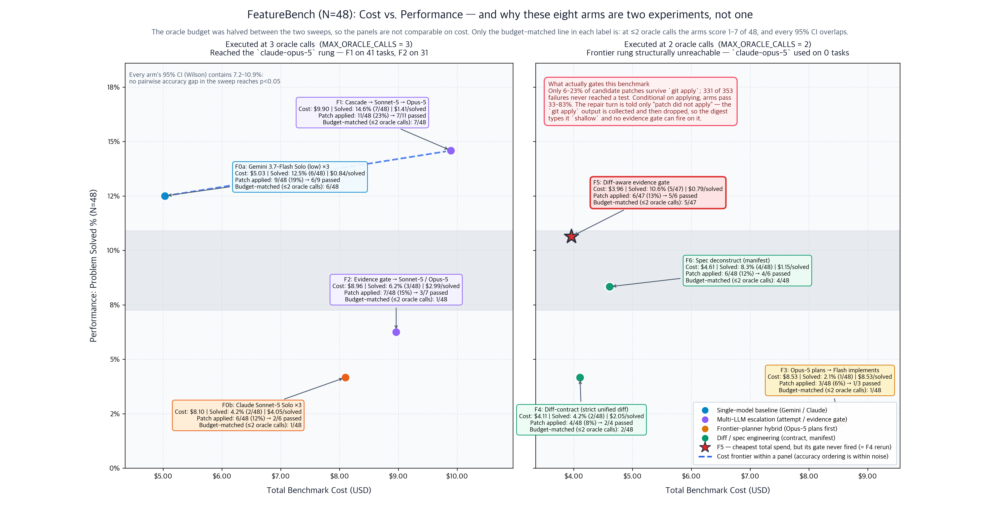

# FeatureBench N=48 — validity audit and lessons

Eight arms, 48 tasks, live API, `ctx-harness` 0.35.1 on the `library` backend,
zero simulated calls. Reported in
[report 20](../reports/20_featurebench_straitjacket_n48.md) (F0a–F3) and
[report 22](../reports/22_featurebench_straitjacket_n48.md) (F4–F6).

FeatureBench was adopted to settle **H2** — does *fail → escalate* still beat
front-loaded planning when the oracle stops being free? Every earlier finding
here was measured where a test run costs $0 in milliseconds, the regime that
most favours escalation. FeatureBench's oracle is a container run (~57 s).

**Verdict: the execution is honest, the measurement is not usable for ranking
architectures.** No number was fabricated — the harness refused to simulate, gold
was verified, every LLM call is priced. But the defects below mean three arms did
not run the architecture their row is labelled with, and the eight arms did not
run under one protocol. The per-arm ordering in both reports should not be quoted.



```bash
python3 visualization/generate_featurebench_n48_chart.py
```

---

## 1. Verdict table

| Question | Answer |
|---|---|
| Were the numbers really produced by live runs? | **Yes.** `simulated_tasks = 0`, `simulated_calls = 0` on all 8 arms; backend `library`, `ctx-harness` 0.35.1. |
| Is the grading sound? | **Yes.** Gold verified on all 48 rows; graded test files restored over every candidate, so a patch cannot pass by editing tests. |
| Is the cost accounting sound? | **Yes.** Every LLM call is priced through one table, including F3's planner and F6's manifest call. |
| Did each arm run the architecture its row names? | **No — 3 of 8 did not.** §3. |
| Were all arms measured under one protocol? | **No.** The oracle budget was 3 calls for F0a/F0b/F1/F2 and 2 for F3–F6. §2. |
| Do the per-arm differences mean anything? | **No.** No pairwise gap reaches p < 0.05, and the dominant term is diff syntax, not routing. §4, §5. |

---

## 2. Defect 1 — the arms did not share an oracle budget

`MAX_ORACLE_CALLS` was changed from 3 to 2 in commit `662859e`, and the two
sweeps straddle that change. The records prove which side each arm is on:

| Arm | Rung sequences observed | Oracle budget | Reached `claude-opus-5` |
|---|---|---|---|
| F0a | `flash × 3` on 42 tasks | **3** | — |
| F0b | `sonnet × 3` on 47 tasks | **3** | — |
| F1 | `flash → sonnet → opus` on 41 tasks | **3** | **41/48** |
| F2 | `flash → sonnet → opus` on 30 tasks | **3** | **31/48** |
| F3 | `flash → flash` on all 48 | **2** | 0 |
| F4 / F5 / F6 | 2 rungs on every task | **2** | **0** |

Two consequences, and the second is the serious one:

- **The cost axis is not comparable across the split.** Roughly $7.86 of F1's
  $9.90 is attributable to its third rung, which is the Opus rung. Budget-matched
  at two calls, F1 would cost about $2.03 — cheaper than F5.
- **At two oracle calls with a two-entry `TIERS`, the frontier rung is
  unreachable by construction.** `_ladder` runs its repair loop exactly once, so
  no gate condition indexed on `loop >= 2` or `loop >= len(tiers)` can ever be
  true. F4, F5 and F6 all record `frontier_used = 0`. **Report 22 therefore
  contains no multi-tier escalation result at all** — it is three variants of
  flash → sonnet.

The same trap hit F3 *inside report 20*: the H2 challenger got two oracle calls
while the three arms it is tabulated against got three. That is precisely the
budget-matching principle `src/featurebench.py`'s own module docstring says the
sweep rests on ("Every arm makes exactly 3 oracle calls… that is the resource H2
says is scarce, so it is the one held constant"). The docstring still says 3; the
constant says 2.

Four of the arms were also **not re-executed** for the run that wrote report 20 —
F0a, F0b, F1 and F2 record `seconds = 0.0`, i.e. every task was served from
cache, while F3 ran live for 2,847 s. The cached records predate the budget
change; the report around them does not.

**Budget-matched recount.** Passes reached within two oracle calls — the only
accuracy figure comparable across the whole set:

| | F0a | F0b | F1 | F2 | F3 | F4 | F5 | F6 |
|---|---|---|---|---|---|---|---|---|
| As reported | 6/48 | 2/48 | 7/48 | 3/48 | 1/48 | 2/48 | 5/47 | 4/48 |
| **At ≤2 oracle calls** | **6/48** | **1/48** | **7/48** | **1/48** | **1/48** | **2/48** | **5/47** | **4/48** |

The third rung bought F0b one task and F2 two; it bought F0a and F1 nothing. So
the budget confound does **not** manufacture the accuracy ordering — but it does
inflate the reported cost of four arms, and it silently removes the frontier
model from four others.

```bash
python3 - <<'PY'
import json, collections
for f in ("featurebench/results/featurebench_featurebench_results.json",
          "featurebench/results/featurebench_all_results.json"):
    for s in json.load(open(f))["summary"]:
        rungs = collections.Counter(
            tuple((r.get("routing") or {}).get("rungs") or []) for r in s["results"])
        matched = sum(1 for r in s["results"] if r["passed"] and r.get("repair_loops", 0) <= 1)
        print(s["id"], "| matched<=2 calls:", f"{matched}/{s['n']}",
              "| frontier_used:", sum(1 for r in s["results"]
                                      if (r.get("routing") or {}).get("frontier_used")))
        for k, v in rungs.most_common(3):
            print("   ", v, "x", k)
PY
```

## 3. Defect 2 — three rows are labelled as architectures they did not run

**F1 is labelled without the model it spent most of its money on.** The registry
name and the report's Models column read `3.7-flash -> sonnet-5`. The data shows
`flash → sonnet → opus` on 41 of 48 tasks. Commit `662859e` renamed the arms —
`(3 rungs)` → `(2 rungs)`, and `F1. Cascade: 3.7-flash -> sonnet-5 -> opus-5` →
`F1. Cascade: 3.7-flash -> sonnet-5` — to match the new budget, and the report
was then regenerated from cached records produced under the *old* budget. The
label describes code that never produced these rows.

**F2 fails the repository's own quoting rule.** `run_fb_evidence_gate`'s
docstring states: "without a typed fact tier the gate has nothing to read,
`routing.degraded` is set, and **the row must not be quoted as an evidence-gate
result**." F2 records `routing.degraded = true` on **45 of 48 tasks**. Report 20
quotes it anyway. Its evidence clause fired on exactly **one** task; the other 30
escalations came from the ladder-exhausted fallback, which is F1's rule. On this
dataset F2 is F1 wearing a different name, 31 times out of 32.

**F5's gate is unreachable, so F5 is F4 run twice.** Its gate escalates on
`broad`/`stalled` difficulty, on `"patch did not apply" and loop >= 2`, or on
`loop >= n_tiers`. With one repair loop, all three clauses are dead:

```
F4 rung sequences: {(flash/low, sonnet-5/off): 46, (flash/low,): 2}
F5 rung sequences: {(flash/low, sonnet-5/off): 45, (flash/low,): 2}
F5 escalation decisions: {(escalate=False, "stay on standard tier"): 45}
F5 frontier_used: 0
```

The same configuration scored 2/48 and 5/47 in two executions — **Fisher exact
p = 0.27**, an unremarkable draw. Report 22 §3 names F5 "cheapest per solved
task" off that gap. It is a coin flip.

**The generalisation:** an arm is evidence for its name only if its
distinguishing branch is observed to fire. Assert on the routing trace —
`frontier_used`, `decisions[].escalate`, `degraded` — before a row enters a
comparison table. A gate that never fires is not a conservative gate; it is a
mislabelled arm.

## 4. Defect 3 — the repair turn was blind on 94% of failures

`patch did not apply` is **331 of the 353 recorded failures (94%)**, and the modal
error in every arm — 77% of F1's tasks up to 94% of F3's.

`FeatureBenchEnv._try_apply` runs `git apply --verbose`, then
`patch --batch --fuzz=5 -p1`, and records what each said in `self.apply_log`.
That log is read by the preflight and by the setup-time error path — but
`score()` discards it and returns a fixed string:

> `patch did not apply (tried git apply then patch --fuzz=5). Re-emit the diff against the files as they exist at this commit.`

So on 94% of failures the repair model is told *that* its diff failed and never
*why* — no rejected hunk, no line number, no offset. That is deliberate for
containment purity (patch application runs outside the harness so `git apply`
chatter stays out of the ledger), but it has three effects that decide the sweep:

1. The repair turn cannot do the one thing it is there for.
2. The digest types a ~31-token constant as `shallow`, so **no evidence gate can
   ever fire on the dominant failure mode**. Across F4–F6, 131 of 137 classified
   attempts were `shallow` and 6 `local`; not one reached `broad` or `stalled`.
3. The independent variable (when to spend the frontier model) was therefore held
   near-constant by a confound (whether the diff parsed).

Conditional on the patch applying, the arms resolve **33–83%** of rows — inside
the band upstream reports for frontier agents. The models were largely not
failing to implement the feature; they were failing to express it as a diff
`git apply` accepts, and then getting no help fixing that.

## 5. Defect 4 — N=48 cannot rank eight arms, and the 48 are not a random sample

Every arm's 95% Wilson interval contains **7.2–10.9%**. No pairwise comparison
reaches p < 0.05, including the widest (F1 7/48 vs F3 1/48, p = 0.059).

The union of everything solved by any arm is **15/48 (31.3%)**, and **9 of those
15 were solved by exactly one arm**; one task was solved by seven. On BCB-Hard
N=148 the same decomposition showed heavy overlap — models agreeing on which
tasks are easy. Here they barely agree, which is what near-random success looks
like when the gating step is unrelated to task difficulty.

The sample compounds it. `load_featurebench_problems` takes rows in **file
order** and stops at `max_tasks`, so N=48 is the first 48 non-quarantined rows —
**three repositories** (mlflow 20, pandas 18, astropy 10) out of FeatureBench's
24. Tasks inside one repository share diff conventions and layout, so they are
not independent draws and the effective sample is well under 48. The quarantine
file also records `"n_checked": 54, "partial": true` against `"n_tasks": 100`:
46 rows of the fast split were never gold-checked.

Two rules to carry forward:

- **Report the interval, or do not report the ranking.** `src/reporter.py` closes
  every report with "X is the cheapest per solved task; Y has the highest pass
  rate", generated unconditionally. On a low-pass-rate dataset that sentence
  manufactures a winner out of a tie.
- **Sample the dataset, do not take a prefix of it.** A repository-clustered
  prefix cannot support a claim about the benchmark.

## 6. Defect 5 — the metric that would have separated the arms was computed and dropped

[`src/featurebench.py:207`](../src/featurebench.py) returns `test_pass_ratio`,
the fraction of executed test cases that passed, precisely because
[the setup doc](featurebench-setup.md) argues that at a 20–47% resolve rate a
binary verdict makes every cheap arm read as an undifferentiated zero.

The persisted record in [`src/sweep.py`](../src/sweep.py) is an explicit field
allowlist, and in the code that produced these sweeps `test_pass_ratio` was not
in it. It was dropped before anything was written, so it reaches no result file
and no report: the one measurement designed to survive a low resolve rate is the
one measurement these sweeps do not have. (A fix carrying it — and per-attempt
guard reasons — through the allowlist is in progress in the working tree; it does
not retroactively give reports 20 and 22 the field.)

**The generalisation:** an allowlist-shaped serialiser silently discards new
fields. Any metric a doc promises needs a test asserting it reaches the result
file — the standard the containment ledger is already held to.

## 7. What *is* trustworthy in these runs

Worth stating explicitly, because "not usable for ranking" is not "fabricated":

- **No simulated results.** `simulated_tasks = 0` and `simulated_calls = 0` on
  all eight arms; the client refuses rather than fabricates.
- **The grading is real and hard to game.** Graded test files are staged from the
  commit and copied back over every candidate, with a verified count rather than
  a silent `|| true`, so a patch cannot pass by editing tests. Gold was verified
  on all 48 rows before they were run.
- **The task set is identical across arms** — the same 48 ids everywhere, except
  one F5 row lost to a `504 DEADLINE_EXCEEDED` and correctly recorded as
  incomplete rather than as a failure.
- **Cost accounting is complete.** Every LLM call goes through `_spend`, including
  F3's planner and F6's manifest turn, priced from one table.
- **The containment receipts are sound**, and behave exactly as documented.
  Deltas against the native baseline run from **+20% (F0a) to −24% (F2)**, and the
  negative rows are printed as plainly as the positive ones. F0a captured 101,118
  tokens and sent 4,251 where the untreated path would have sent 5,288. Where the
  failure is a two-line `patch did not apply` there is nothing to contain, and
  F4/F5/F6 accordingly show the smallest payloads (~1,700 tokens) and the smallest
  deltas (+6%, −3%, +3%). **Containment pays in proportion to how much output the
  failure produced** — the README's claim, now observed on a dataset that mostly
  produces short failures.

And three cost facts survive the noise, because they are ordinal facts about
spend rather than close calls about accuracy:

1. **Spend separates by 2.5× where accuracy does not separate at all.**
2. **`claude-sonnet-5` solo is the worst value here** at $4.05/solved, 5.1× F5's
   unit cost — the same model that was the *cheapest* arm per solved task on
   BCB-Hard. **`$/solved` is not a model property and does not transfer across
   datasets.**
3. **The frontier planner (F3) is the most expensive per solved task** at $8.53
   and its patches applied least often (3/48). Suggestive for H2, not evidence
   for it: F3 also ran a smaller oracle budget than its comparators, and 1/48 vs
   6/48 is p = 0.11.

---

## 7b. Root cause of the 94% — two harness bugs and one missing input

§4 established *that* the sweep died at `git apply`. Three findings explain
*why*, and all three are the harness's, not the models'.

### 7b.1 The applier never ran

`extract_patch` ended every return path with `.strip("\n")`, deleting the
trailing newline from every candidate diff the sweep ever scored. A unified
diff whose last line has no newline is not a diff `git apply` will read: it
exits **128 `corrupt patch at line N`** before it looks at the worktree at all.

Measured on a scratch repository, one hunk against one file:

| candidate | with trailing newline | without (what the harness wrote) |
|---|---|---|
| byte-perfect diff | applies under all 5 strategies | **0 of 5** |
| wrong `@@` line numbers | applies | **0 of 5** |
| hallucinated context lines | applies via `--recount --ignore-whitespace -C1` | **0 of 5** |
| wrong indentation | applies via `--recount --ignore-whitespace -C1` | **0 of 5** |
| new file (`--- /dev/null`) | applies | `patch --fuzz` only |

So the strict applier was never exercised, and the loose `patch --fuzz=5`
fallback was silently the *only* applier in the pipeline — which is also why
widening `_APPLY_STRATEGIES` alone changes nothing: with the newline stripped,
all five entries fail identically. **The fix is one byte, and it is a
precondition for every other applier improvement.**

### 7b.2 Only the first fenced block was read

`extract_patch` used `re.search`, so a response that fences one diff per file —
routine for a multi-file feature — was scored on its first file alone. A
partial patch fails the tests, and the row reads as a model failure.

### 7b.3 The model was never shown the repository

The deepest one. `_context()` gives the model the repository *name*, the base
commit, the test filenames and the feature request — and no source code. A
unified diff for an existing file is a claim about bytes already on disk, and
`git apply` matches context lines literally. **A model that has never read the
file is guessing them.**

This reframes F4 and F6 entirely. Both attacked the symptom through diff
*syntax* — a stricter contract, a file manifest — and neither moved the
application rate, because the diffs were not malformed. They were well-formed
diffs about files nobody had read. F4's contract even instructs "keep hunk
context lines minimal (1-2 lines)", which shrinks the anchor the applier
matches on.

## 7c. What has been fixed

Committed alongside this document:

| Fix | Where | Effect |
|---|---|---|
| Trailing newline guaranteed on every extracted patch | `_terminate_patch` in [`src/evaluator.py`](../src/evaluator.py) | `git apply` runs at all, for the first time |
| All fenced diff blocks concatenated, not just the first | `extract_patch` | multi-file answers are scored whole |
| Repository files quoted into the prompt from the row's own container | `collect_repo_context` in [`src/featurebench.py`](../src/featurebench.py) | context lines can be copied instead of invented |
| Two new arms, `fb_grounded` (F7) and `fb_grounded_gate` (F8) | registry | the grounding effect is measured against `fb_cascade` / `fb_evidence_gate` rather than assumed |

End-to-end check on a real repository, same model-shaped response and the same
five strategies:

```
BEFORE (trailing newline stripped): patch did not apply (5 strategies tried)
AFTER  (newline restored)         : APPLIED via git apply --verbose --recount --ignore-whitespace -C1
```

**Two things the grounded arms deliberately do not do.** They do not quote the
graded test files — that is the API contract the row is scored on, and quoting
it would change what the benchmark measures rather than how well the harness
measures it (`FB_GROUND_TESTS=1` opts in, and a report that uses it must say
so). And they do not replace the existing arms: grounding is per-arm, the blind
arms are byte-identical to before, and F7/F8 sit in their own category so
`--group featurebench` is not silently repriced by the extra input tokens.

```bash
# `--out` is not optional here: without it `--group` defaults to `all` and the
# run overwrites featurebench_all_results.json, which is report 22's raw data.
cp featurebench/results/cache_featurebench_master.json{,.bak}
python3 run_benchmark.py --dataset featurebench --no-cache \
    --variants fb_cascade,fb_grounded,fb_evidence_gate,fb_grounded_gate \
    --out featurebench/results/featurebench_grounding_ab_results.json
```

**What is not yet known.** None of this has been run against live Docker — the
audit and the fixes are from the records, the source and a scratch-repository
reproduction. The application rate is the number to read first on the rerun; if
it does not move well above 25%, the diagnosis in §7b.3 is wrong and the arms
are failing for a reason nobody has found yet.

## 8. What a rerun needs

H2 remains open. The pre-registered next step in
[`pattern-dataset-selection.md`](pattern-dataset-selection.md) still stands, with
six preconditions:

1. **Fix the diff channel.** Return the `git apply` / `patch` output as evidence
   instead of a constant string; accept whole-file rewrites or a fuzzy/AST-aware
   applier; and give non-application its own typed, escalatable failure class so a
   gate can act on it. A rerun that repeats a <25% application rate repeats this
   result.
2. **Pick one oracle budget and assert it.** A test should fail if any arm's
   observed rung depth differs from the declared budget.
3. **Make the ladder deep enough to reach the frontier**, or stop naming arms
   after a rung they cannot reach.
4. **Assert each arm's distinguishing branch fires**, and refuse to tabulate a row
   with `routing.degraded` set — the rule the repository already wrote down and
   then did not apply to F2.
5. **Persist and report `test_pass_ratio`.** A graded metric is what makes N=48
   informative at this resolve rate.
6. **Sample rows across repositories**, and never regenerate a report from a cache
   written by different code — stamp each cached record with the code version and
   invalidate on mismatch.

[SWE-bench Pro](swebench-pro-setup.md) removes the graded-tree rebuild that
FeatureBench requires, which is a different failure mode from the one above — it
does not by itself fix diff application. Check the application rate and the
observed rung depth on its reports
([21](../reports/21_swebench-pro_straitjacket_n50.md),
[23](../reports/23_swe-bench-pro-candidates_straitjacket_n50.md)) before reading
their arm ordering.
